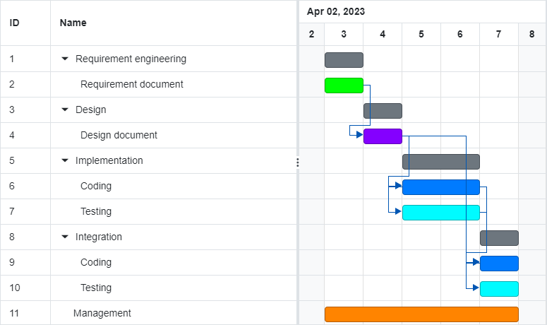

# Project Estimation - CURRENT
Date: 20.04.2023

Version: 1

# Estimation approach
In this estimation document we are performing a type of reverse engineering considering the code we were provided with. So in summary, we are estimating how much it would take to bring the project at the point it is now, but of course this estimation is not applicable since we already have the code. In estimation document v2 we are going to make a more meaningful estimation, considering also the added features and the finalization of the project. 
# Estimate by size
### 
|             | Estimate                        |             
| ----------- | ------------------------------- |  
| NC =  Estimated number of modules to be developed   |      9                       |             
|  A = Estimated average size per module, in LOC       |      80                      | 
| S = Estimated size of project, in LOC (= NC * A) |           720 |
| E = Estimated effort, in person hours (here use productivity 10 LOC per person hour)  |            72                          |   
| C = Estimated cost, in euro (here use 1 person hour cost = 30 euro) | 2160| 
| Estimated calendar time, in calendar weeks (Assume team of 4 people, 8 hours per day, 5 days per week ) |         0.5            |               

# Estimate by product decomposition
### 
|         component name    | Estimated effort (person hours)   |             
| ----------- | ------------------------------- | 
|requirement document    | 15 |
| GUI prototype |5|
|design document |10|
|code |60|
| unit tests |20|
| api tests |20|
| management documents  |10|

# Estimate by activity decomposition
### 
|         Activity name    | Estimated effort (person hours)   |             
| ----------- | ------------------------------- | 
|1 Requirement engineering (Requrirement document)|28 |
|2 Design (Design document)|28 |
|3 Implementation (Coding + Testing)|56 |
|4 Integration (Coding + Testing)|28 |
|3 Management |20 |
###
 Note: We consider Management as a parallel work to anything else. So in our opinion it should not require a full working day by the team (we are considering approximately 1h per day by each member for management and 7h for the rest of the tasks) but it needs to be present everyday, so that is why it looks continuous in the Gantt chart.

# Summary

As a result we are presenting a summary with the estimated effort and duration for each estimation approach, by size, by product decomposition, and by activity decompostion. As we can see in the table below, both estimated effort and duration increase respectively for different estimation approaches. This is to be considered a normal behavior with a very easy logical explanation. In the estimation by size we are only considering coding part, while for the two other approaches we are also considering documentation and extra processes, so as a result the estimation by size is the lowest. When we compare estimation by product decomposition and estimation by activity decomposition we have a much smaller gap, since the reference measuring units are much more related and comparable to each other, but estimation by activitiy decomposition yields a higher estimated effort and therefore duration. This is because, in activity decomposition when we calculate person hours for the activity and lay it out in Gantt chart we may add extra hours to complete full working days for the easiness of calculation and representation. Another explanation for these differences in the end estimated effort and duration values is also the tendency to overestimate a bit, since it is easier to overestimate slightly in the requirement engineering phase than to have to allocate extra time and resources at the middle or end of the project. 

|             | Estimated effort                        |   Estimated duration |          
| ----------- | ------------------------------- | ---------------|
| estimate by size |72|0.5
| estimate by product decomposition |140|~1
| estimate by activity decomposition |160|1

