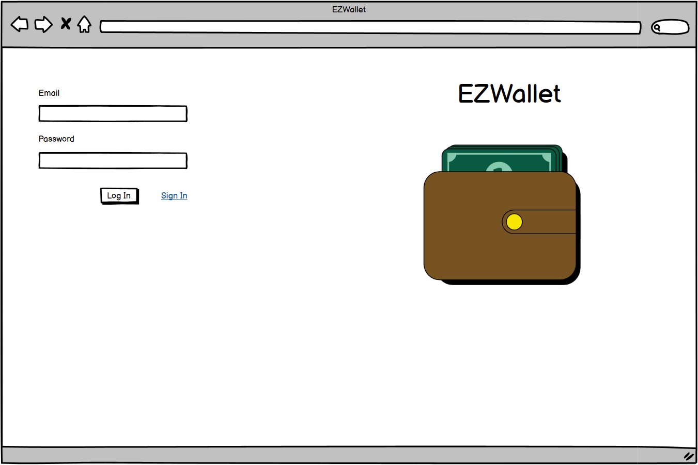
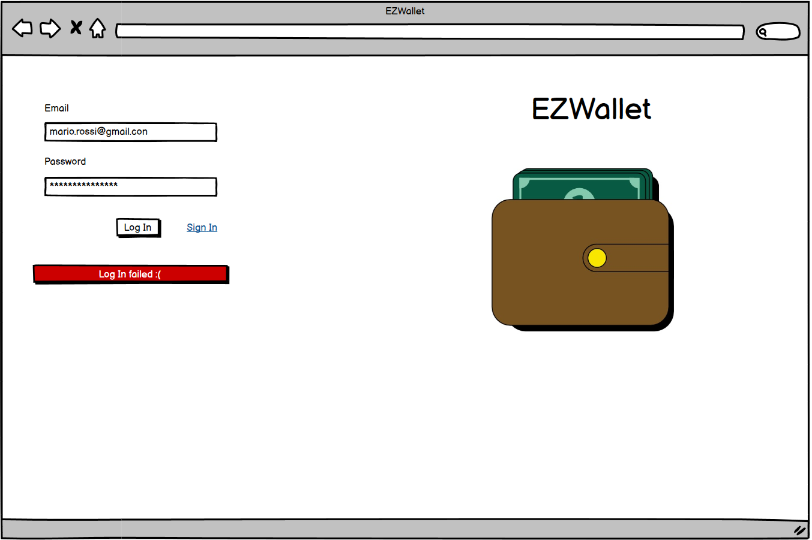
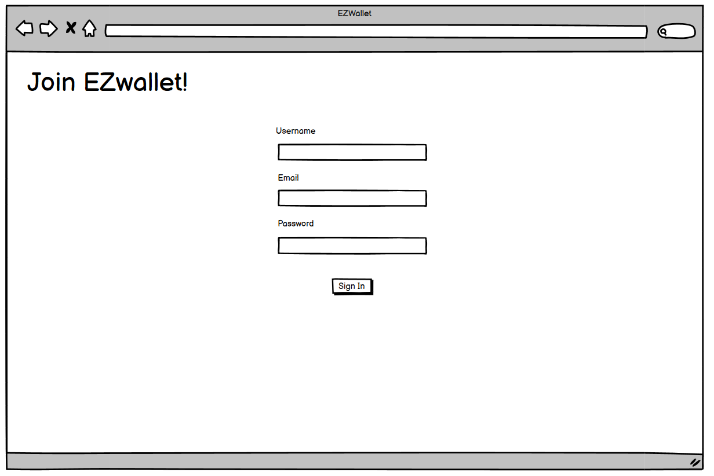
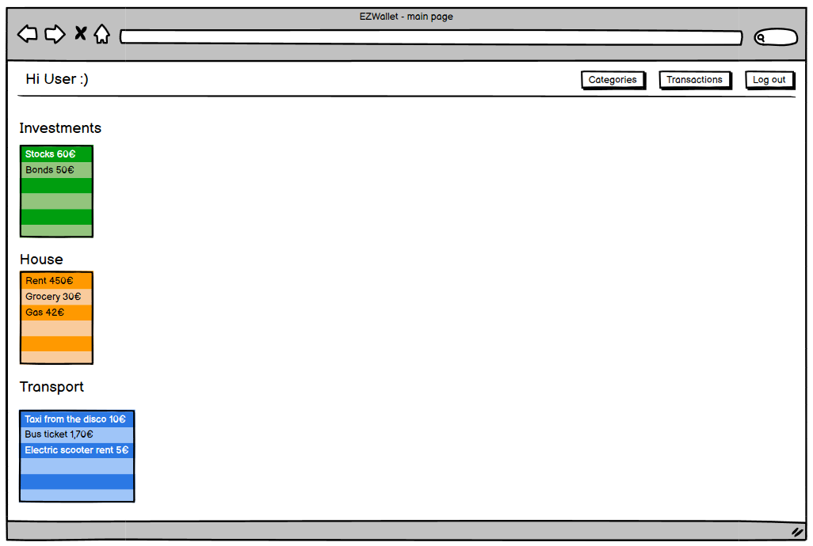
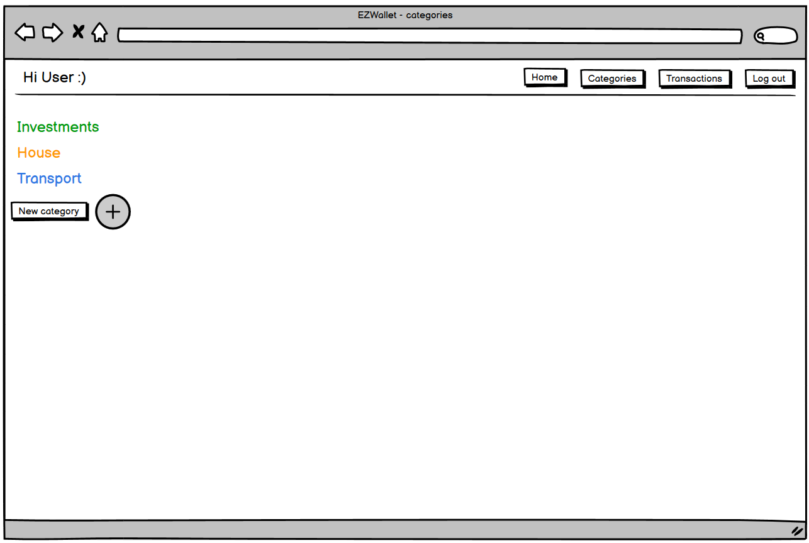
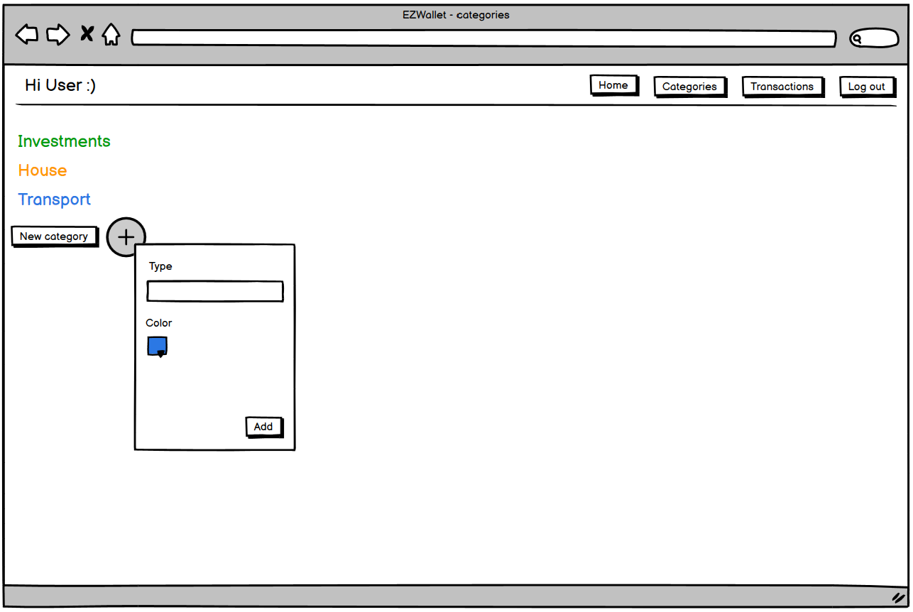
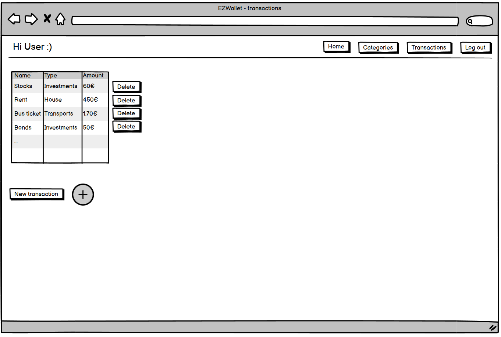
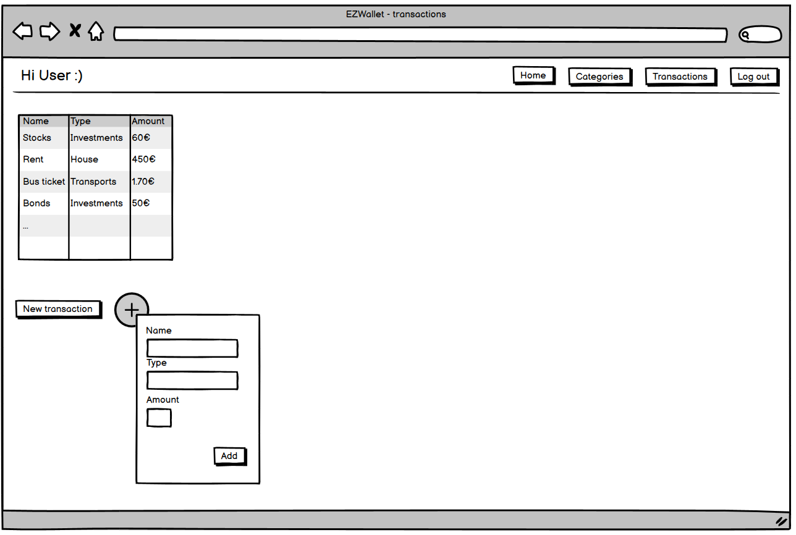

# Graphical User Interface Prototype  - CURRENT

Authors:

Date:

Version:

\<Report here the GUI that you propose for EZWallet in CURRENT form, as received by teachers. You are free to organize it as you prefer. A suggested presentation matches the Use cases and scenarios defined in the Requirement document. The GUI can be shown as a sequence of graphical files (jpg, png)  >

# Contents

- [Log in](#log-in)
    + [log in page](#log-in-page)
    + [log in failed](#log-in-failed)
- [Sign in](#sign-in)
- [Main page](#main-page)
- [Categories section](#categories-section)
    + [categories page](#categories-page)
    + [new category menu](#new-category-menu)
- [Transactions section](#transactions-section)
    + [transactions page](#transactions-page)
    + [new transaction menu](#new-transaction-menu)

## Log in
### Log in page
{width=40%}
### Log in failed
{width=40%}
## Sign in
{width=40%}
## Main page
{width=40%}
## Categories section
### Categories page
{width=40%}
### New category menu
{width=40%}
## Transactions section
### Transactions page
{width=40%}
### New transaction menu
{width=40%}

