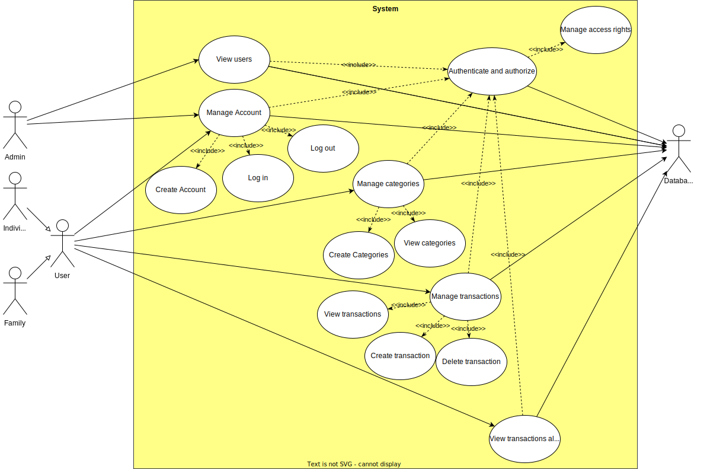
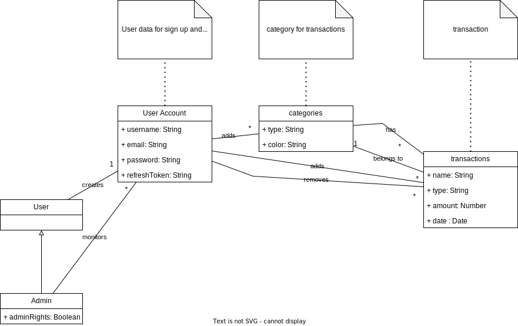

# Requirements Document - current EZWallet

Date: 

Version: V1 - description of EZWallet in CURRENT form (as received by teachers)

 
| Version number | Change |
| ----------------- |:-----------|
| 0.1.11 | added stakeholders| 
| 0.2.2 | added context diagram|
| 0.3.1 | added interfaces| 
| 0.4.5 | added Functional requirements |
| 0.5.1 | added non functional requirements |
| 0.6.1 | added use case diagram |
| 0.7.1 | added Glossary |

# Contents

- [Informal description](#informal-description)
- [Stakeholders](#stakeholders)
- [Context Diagram and interfaces](#context-diagram-and-interfaces)
	+ [Context Diagram](#context-diagram)
	+ [Interfaces](#interfaces) 
	
- [Stories and personas](#stories-and-personas)
- [Functional and non functional requirements](#functional-and-non-functional-requirements)
	+ [Functional Requirements](#functional-requirements)
	+ [Non functional requirements](#non-functional-requirements)
- [Use case diagram and use cases](#use-case-diagram-and-use-cases)
	+ [Use case diagram](#use-case-diagram)
	+ [Use cases](#use-cases)
    	+ [Relevant scenarios](#relevant-scenarios)
- [Glossary](#glossary)
- [System design](#system-design)
- [Deployment diagram](#deployment-diagram)

# Informal description
EZWallet (read EaSy Wallet) is a software application designed to help individuals and families keep track of their expenses. Users can enter and categorize their expenses, allowing them to quickly see where their money is going. EZWallet is a powerful tool for those looking to take control of their finances and make informed decisions about their spending.

# Stakeholders

| Stakeholder name  			| Description | 
| ----------------- 			|:-----------:|
| User (Individual) 		| tracks their personal expenses | 
| User (Family) 			| tracks their family expenses |
| User (Admin)				| manages registered users |
| Project Team 				| develops, tests and maintains app |
| Company(Owner)			| owns the app, employs and oversees developers, manages finances, takes executive decisions during app development |
| Hosting service 			| host the app, provide api, make app accessible on the internet, provide data security, guarantee uptime |
| Database service 			| deploy, store, manage and secure database for the user data online storage and retrieval through app|

# Context Diagram and interfaces

## Context Diagram
<!--Define here Context diagram using UML use case diagram-->

<!--actors are a subset of stakeholders-->

## Interfaces
<!--
\<describe here each interface in the context diagram>

\<GUIs will be described graphically in a separate document>
-->
| Actor 		| Logical Interface 	| Physical Interface  |
| ------------- |:-----------------:	| :------------------:|
| User(Individual, Family, Admin)	  	|GUI			 		| PC, Smartphone, Tablet |
| Hosting Service						| VM, Filesystem, Cloud	| Server|
| Database Service(MongoDB)				| mongoose api (https://mongoosejs.com/docs/index.html)| Internet link |

# Stories and personas
\<A Persona is a realistic impersonation of an actor. Define here a few personas and describe in plain text how a persona interacts with the system>

\<Persona is-an-instance-of actor>

\<stories will be formalized later as scenarios in use cases>

# Functional and non functional requirements

## Functional Requirements
<!--
\<In the form DO SOMETHING, or VERB NOUN, describe high level capabilities of the system>

\<they match to high level use cases>
-->

| ID 		| Description  	|
| ----- 	|:-------------:| 
| <b>FR1</b>		| <b>Manage account</b> |
| + FR1.1	| Create account|
| + FR1.2	| Log in  		|
| + FR1.3 	| Log out 		|
| + FR1.4 	| Authenticate and authorize	|
| + FR1.5 	| Manage access rights			|
| + FR1.6 	| View users 	|
| <b>FR2</b>		| <b>Manage categories</b> | 
| + FR2.1	| Define category	|
| + FR2.2	| View categories	|
| <b>FR3</b>		| <b>Manage transactions</b>	|
| + FR3.1	| add transaction		|
| + FR3.2	| View transactions		|
| + FR3.3	| remove transaction	|
| <b>FR4</b>		| <b>View transactions along with their categories</b>|

## Non Functional Requirements
<!--
\<Describe constraints on functional requirements>
-->
| ID        | Type (efficiency, reliability, ..)           | Description  | Refers to |
| ------------- |:-------------:| :-----:| -----:|
| NFR1 | Usability | no training required, user rating > 4,5/5 | FR:1.1,1.2,1.3,1.6,2,3,4 |
| NFR2 | Efficiency | < 0.2ms function response time | All FR |
| NFR3 | Reliability | > 99.99% uptime, < 1hr/year downtime | FR:1.1,1.2,1.3,1.6,2,3,4 |
| NFR4 | Portability | Android version >=7, IOS version >= 10, Windows version >= 10, latest stable firefox, chrome, edge browsers with JS and cookies enabled | FR:1.1,1.2,1.3,1.6,2,3,4 |
| NFR5 | Security | GDPR, CCPA, ISO/IEC 27000-series compliance | All FR |
| NFR6 | Maintainability | < 24 hr app migration to different service, < 6 hr recovery after failure | All FR |

# Use case diagram and use cases

## Use case diagram
<!--
\<define here UML Use case diagram UCD summarizing all use cases, and their relationships>

\<next describe here each use case in the UCD>
-->

### Use case 1, UC1
| Actors Involved        |  |
| ------------- |:-------------:| 
|  Precondition     | \<Boolean expression, must evaluate to true before the UC can start> |
|  Post condition     | \<Boolean expression, must evaluate to true after UC is finished> |
|  Nominal Scenario     | \<Textual description of actions executed by the UC> |
|  Variants     | \<other normal executions> |
|  Exceptions     | \<exceptions, errors > |

##### Scenario 1.1 

\<describe here scenarios instances of UC1>

\<a scenario is a sequence of steps that corresponds to a particular execution of one use case>

\<a scenario is a more formal description of a story>

\<only relevant scenarios should be described>

| Scenario 1.1 | |
| ------------- |:-------------:| 
|  Precondition     | \<Boolean expression, must evaluate to true before the scenario can start> |
|  Post condition     | \<Boolean expression, must evaluate to true after scenario is finished> |
| Step#        | Description  |
|  1     |  |  
|  2     |  |
|  ...     |  |

##### Scenario 1.2

##### Scenario 1.x

### Use case 2, UC2
..

### Use case x, UCx
..

# Glossary
<!--
\<use UML class diagram to define important terms, or concepts in the domain of the application, and their relationships> 
\<concepts must be used consistently all over the document, ex in use cases, requirements etc>
-->

# System Design
\<describe here system design>

\<must be consistent with Context diagram>

# Deployment Diagram 

\<describe here deployment diagram >

