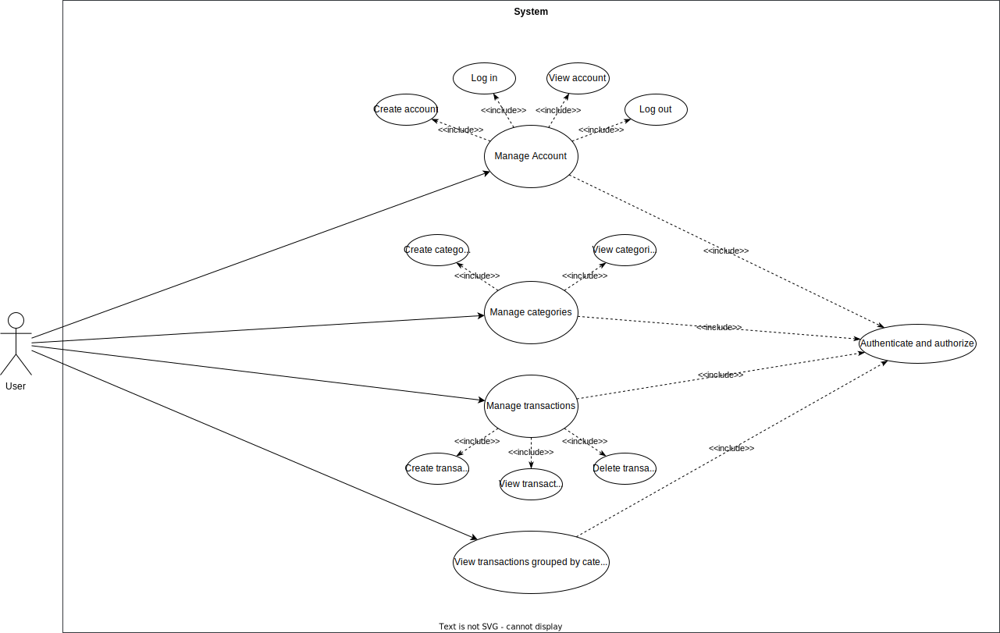

# Requirements Document - current EZWallet

Date: 

Version: V1 - description of EZWallet in CURRENT form (as received by teachers)

 
| Version number | Change |
| ----------------- |:-----------|
| 0.1.11 | added stakeholders| 
| 0.2.2  | added context diagram|
| 0.3.1  | added interfaces| 
| 0.4.5  | added Functional requirements |
| 0.5.1  | added non functional requirements |
| 0.6.1  | added use case diagram |
| 0.7.1  | added Glossary |
| 1.0.0	 | added use cases, system diagram, deployment diagram, stories and personas |
| 1.1.0  | removed admin and users, replaced with a generic user |
| 1.1.1  | removed database and hosting services |
| 1.1.2  | added temporary section : software bugs |
| 1.2.1 | added use cases and scenarios |
| 1.3.1 | add view account use case |

# Contents

- [Informal description](#informal-description)
- [Stakeholders](#stakeholders)
- [Context Diagram and interfaces](#context-diagram-and-interfaces)
	+ [Context Diagram](#context-diagram)
	+ [Interfaces](#interfaces) 
	
- [Stories and personas](#stories-and-personas)
- [Functional and non functional requirements](#functional-and-non-functional-requirements)
	+ [Functional Requirements](#functional-requirements)
	+ [Non functional requirements](#non-functional-requirements)
- [Use case diagram and use cases](#use-case-diagram-and-use-cases)
	+ [Use case diagram](#use-case-diagram)
	+ [Use cases](#use-cases)
    	+ [Relevant scenarios](#relevant-scenarios)
- [Glossary](#glossary)
- [System design](#system-design)
- [Deployment diagram](#deployment-diagram)
- [Software Bugs](#software-bugs)

# Informal description
EZWallet (read EaSy Wallet) is a software application designed to help individuals and families keep track of their expenses. Users can enter and categorize their expenses, allowing them to quickly see where their money is going. EZWallet is a powerful tool for those looking to take control of their finances and make informed decisions about their spending.

# Stakeholders

| Stakeholder name  			| Description | 
| ----------------- 			|-----------|
| User						| tracks their expenses |
| Project Team 				| develops, tests and maintains app |
| Company(Owner)			| owns the app, employs and oversees developers, manages finances, takes executive decisions during app development |

# Context Diagram and interfaces

## Context Diagram
<!--Define here Context diagram using UML use case diagram -->

<!--actors are a subset of stakeholders-->

## Interfaces
<!--
\<describe here each interface in the context diagram>

\<GUIs will be described graphically in a separate document>
-->
| Actor 		| Logical Interface 	| Physical Interface  |
| ------------- |-----------------| ------------------|
| User 		  	|GUI			 		| PC, Smartphone, Tablet |

# Stories and personas
Persona 1: student, male, 20, low income.
* Story: Rented a house, needs to keep track of his expenses so he can pays his rent each month.

Persona 2: employee, female, 42, medium income, married with children, providing for the whole family.
* Story: Since she’s the only one working in the family, she needs to know how family spends money.

Persona 3: unemployed, male, 35, no income with little savings.
* Story: Needs to keep track of his expenses and which are the categories where he spends too much.

# Functional and non functional requirements

## Functional Requirements
<!--
\<In the form DO SOMETHING, or VERB NOUN, describe high level capabilities of the system>

\<they match to high level use cases>
-->

| ID 		| Description  	|
| ----- 	|-------------| 
| <b>FR1</b>		| <b>Manage account</b> |
| + FR1.1	| Create account|
| + FR1.2	| Log in  		|
| + FR1.3	| View account	|
| + FR1.4 	| Log out 		|
| + FR1.5 	| Authenticate and authorize	|
| <b>FR2</b>		| <b>Manage categories</b> | 
| + FR2.1	| Define category	|
| + FR2.2	| View categories	|
| <b>FR3</b>		| <b>Manage transactions</b>	|
| + FR3.1	| add transaction		|
| + FR3.2	| View transactions		|
| + FR3.3	| remove transaction	|
| <b>FR4</b>		| <b>View transactions grouped by category</b>|

## Non Functional Requirements
<!--
\<Describe constraints on functional requirements>
-->
| ID        | Type (efficiency, reliability, ..)           | Description  | Refers to |
| ------------- |-------------| -----| -----|
| NFR1 | Usability | no training required, user rating > 4,5/5 | FR:1.1,1.2,1.3,1.4,2,3,4 |
| NFR2 | Efficiency | < 0.2ms function response time | All FR |
| NFR3 | Reliability | > 99.99% uptime, < 1hr/year downtime | FR:1.1,1.2,1.3,1.4,2,3,4 |
| NFR4 | Portability | Latest stable Firefox, Chrome, Edge browsers with JS and cookies enabled | FR:1.1,1.2,1.3,1.4,2,3,4 |
| NFR5 | Security | GDPR, CCPA, ISO/IEC 27000-series compliance | All FR |
| NFR6 | Maintainability | < 24 hr app migration to different service, < 6 hr recovery after failure | All FR |

# Use case diagram and use cases

## Use case diagram
<!--
\<define here UML Use case diagram UCD summarizing all use cases, and their relationships>

\<next describe here each use case in the UCD>
-->

<!-- ## Use case: Create account
Precondition: User has no account

Scenario 1 (nominal):

*	User ask to sign up
*	System asks username
*	System asks email
*	System asks password
*	System stores account

Post condition: User is registered

Scenario (exceptions):

•	Email already used

Post condition: User is not registered
 -->
### Use case 1: Create account
| Actors Involved      	| User 			|
| ------------- 		|-------------| 
|  Precondition     	| User does not have an account 	|
|  Post condition     	| User has account 		|
|  Nominal Scenario     | User starts registration process. The system asks user their details to create an account. User provides the details which is used by the system to create an account for the user.|
|  Exceptions     		| User already has an account |

<!--##### Scenario 1.1 : Nominal -->
| Scenario 1.1 		| 	Nominal			|
| ------------- 	|-------------| 
|  Precondition     | User does not have an account |
|  Post condition   | User has an account |
| Step#	| Description  			|
| 1    	| User asks to register |  
| 2    	| System asks username, email, password |
| 3    	| User enters username, email, password  |
| 4		| System checks that a user with provided email does not already exist |
| 5		| System generates hash value from password and stores the username, email and hashed password.

<!--##### Scenario 1.2 : Exception -->
| Scenario 1.2 		| 	Exception			|
| ------------- 	|-------------| 
|  Precondition     | Email already used to create an account |
|  Post condition   | New account not created |
| Step#	| Description  			|
| 1    	| User asks to register |  
| 2    	| System asks username, email, password |
| 3    	| User enters username, email, password  |
| 4		| System checks that a user with provided email does not already exist |
| 5		| System finds an account with the same email.
| 6		| System returns error message "already registered" |

<!--## Use case: Login
Precondition: User has account

Scenario 1 (nominal):
*	1 User asks to login
*	2 System asks email and password
*	3 User enters email and password
*	4 System checks, email and password correct, user is authorized

Post condition: user is authorized

Scenario (exceptions):
*	User does not exist 
*	User is already logged in
*	Email or password wrong

Post condition  (for all exceptional scenarios): user is not authorized
-->
### Use case 2: Log in
| Actors Involved      	| User 			|
| ------------- 		|-------------| 
|  Precondition     	| User has account		|
|  Post condition     	| User is authorized 	|
|  Nominal Scenario     | User enter  email and password to login. System verifies credentials and authorizes user. |
|  Variants     | User is already logged in and has access token. System notifies user already logged in. |
|  Exceptions     		| User does not have account. Wrong email or password. |

<!--##### Scenario 2.1 : Nominal -->
| Scenario 2.1 		| 	Nominal			|
| ------------- 	|-----------------| 
|  Precondition     | User has account and user is logged out |
|  Post condition   | User is logged in and authorized |
| Step#	| Description  			|
| 1    	| User asks to log in |  
| 2    	| System asks email and password |
| 3    	| User enters email and password  |
| 4		| System searches corresponding account using provided email |
| 5		| System verifies user does not already have accessToken |
| 6		| System generates hash from provided password and verifies that it matches with the stored password hash.
  7		| System generates an access token and a refresh token.|
  8		| System stores the refresh token and returns both refresh token and access token to the user.|
| 9     | User uses the tokens for later queries to the system. |

<!--##### Scenario 2.2 : Nominal -->
| Scenario 2.2 		| 	Variant			|
| ------------- 	|-----------------| 
|  Precondition     | User has account and user is logged in |
|  Post condition   | User is still logged in and authorized |
| Step#	| Description  			|
| 1    	| User asks to log in |  
| 2    	| System asks email and password |
| 3    	| User enters email and password  |
| 4		| System searches corresponding account using provided email |
| 5		| System verifies user does not already have accessToken |
| 6		| User already has accessToken. System
  7		| System generates an access token and a refresh token.|
  8		| System stores the refresh token. |
| 9     | System returns both refresh token and access token to the user in cookie and returns access token also in the body.|
| 10     | User uses the tokens for later queries to the system. |

<!--##### Scenario 2.3 : Exception -->
| Scenario 2.3 		| 	Exception			|
| ------------- 	|-----------------| 
|  Precondition     | User does not have an account or provides wrong unregistered email |
|  Post condition   | User is neither logged in nor authorized |
| Step#	| Description  			|
| 1    	| User asks to log in |  
| 2    	| System asks email and password |
| 3    	| User enters email and password |
| 4		| System searches corresponding account using provided email |
| 5		| System does not find account |
| 6		| System returns error "need to register." |

<!--##### Scenario 2.3 : Exception -->
| Scenario 2.3 		| 	Exception			|
| ------------- 	|-----------------| 
|  Precondition     | User has account, is not logged in and provides either wrong existing email or wrong password |
|  Post condition   | User is neither logged in nor authorized |
| Step#	| Description  			|
| 1    	| User asks to log in |  
| 2    	| System asks email and password |
| 3    	| User enters email and password  |
| 4		| System searches  corresponding account using provided email |
| 5		| System verifies user does not already have accessToken |
| 6		| System generates hash from provided password and verifies that it matches with the stored password hash.
  7		| Password hashes do not match and system returns error "wrong credentials" |

### Use case 3: View account
| Actors Involved      	| User 			|
| ------------- 		|-------------| 
|  Precondition     	| User is logged in 	|
|  Post condition     	| User's account information is displayed 		|
|  Nominal Scenario     | User asks to view his account information and system shows it |
|  Exceptions     		| User is not logged in. User does not provide his own username. |

<!--##### Scenario 3.1 : Nominal -->
| Scenario 3.1 		| 	Nominal			|
| ------------- 	|-------------| 
|  Precondition     | User is logged in |
|  Post condition   | User's account is displayed |
| Step#	| Description  			|
| 1    	| User asks to view his account |
| 2    	| System asks username |  
| 3    	| User provides his username |
| 4    	| System verifies user has both access and refresh token. |
| 5    	| System finds user account using the refresh token. |
| 6		| System verifies the provided username matches found account's username |
| 7		| System returns the account information.

<!--##### Scenario 3.2 : Exception -->
| Scenario 3.2 		| 	Exception			|
| ------------- 	|-------------| 
|  Precondition     | User is not logged in |
|  Post condition   | User's account is not displayed |
| Step#	| Description  			|
| 1    	| User asks to view his account |
| 2    	| System asks username |  
| 3    	| User provides his username |
| 4    	| System verifies user has both access and refresh token. |
| 5    	| System finds empty access token or refresh token.|
| 6   	| System returns error "unauthorized". |

| Scenario 3.3 		| 	Exception			|
| ------------- 	|-------------| 
|  Precondition     | User  |
|  Post condition   | User's account is displayed |
| Step#	| Description  			|
| 1    	| User asks to view his account |
| 2    	| System asks username |  
| 3    	| User provides his username |
| 4    	| System verifies user has both access and refresh token. |
| 5    	| System finds user account using the refresh token. |
| 6		| System verifies the provided username matches found account's username |
| 7		| Usernames do not match. System returns error "unauthorized".

### Use case 4: Log out
<!--Precondition: User is logged in

Scenario 1 (nominal):
*	User ask to log out
*	System logs user out

Post condition: User is not authorized anymore
<!--
Scenario (exceptions):
*	User already logged out
*	User not found

Post condition (for all): User is not authorized anymore
-->

| Actors Involved      	| User 			|
| ------------- 		|-------------| 
|  Precondition     	| User is logged in	|
|  Post condition     	| User is logged out and not authorized any more	|
|  Nominal Scenario     | User asks to log out, and system removes authorization and logs user out |
|  Variants     | User is already logged out. System notifies user logged out. |
|  Exceptions     		| User does not have account. Wrong email/password combination. |

| Scenario 4.1 		| 	Nominal			|
| ------------- 	|-----------------| 
|  Precondition     | User is logged in |
|  Post condition   | User is logged out and not authorized any more |
| Step#	| Description  			|
| 1     | User asks to log out |
| 2     |  System verifies non empty access and refresh tokens. |
| 3		| System uses refresh token to search for the user.	|
| 4		| System sends empty access and refresh tokens. |
| 5 	| System clears stored user's refresh token. |
| 6		| System returns  "logged out"|

| Scenario 4.2 		| 	Variant			|
| ------------- 	|-----------------| 
|  Precondition     | User has account and is logged out |
|  Post condition   | User is still logged out and not authorized |
| Step#	| Description  			|
| 1     | User asks to log out |
| 2     |  System verifies non empty access and refresh tokens. |
| 3		| System finds empty token so user is already logged out and system returns  "logged out"|

| Scenario 4.3 		| 	Exception			|
| ------------- 	|-----------------| 
|  Precondition     | User has wrong refresh token |
|  Post condition   | User not authorized |
| Step#	| Description  			|
| 1     | User asks to log out |
| 2     |  System verifies non empty access and refresh tokens. |
| 3		| System uses refresh token to search for the user.	|
| 4		| System does not find user using the refresh token and returns error "user not found"|

### Use case 5: Create a category
<!--Precondition: User logged in
*	User asks to create a category
*	System asks the type
*	System asks the color
*	System creates the category

Post condition: Category is created
-->
| Actors Involved      	| User 			|
| ------------- 		|-------------| 
|  Precondition     	| User is logged in	|
|  Post condition     	| A category is created	|
|  Nominal Scenario     | User asks to create a  category, system creates it |
|  Exceptions     		| User is not authorized |

| Scenario 5.1 		| 	Nominal			|
| ------------- 	|-----------------| 
|  Precondition     | User is logged in |
|  Post condition   | Category is created |
| Step#	| Description  			|
| 1     | User asks to create a category |
| 2     |  System asks type and color of the category |
| 3		| User provides type and color	|
| 4		| System verifies access token |
| 5		| System creates and stores the category|
| 6 	| System returns created category|

| Scenario 5.2		| 	Exception			|
| ------------- 	|-----------------| 
|  Precondition     | User is not authorized |
|  Post condition   | Category not created |
| Step#	| Description  			|
| 1     | User asks to create a category |
| 2     |  System asks type and color of the category |
| 3		| User provides type and color	|
| 4		| System verifies access token |
| 5		| System finds empty token and returns error "unauthorized" |

### Use case 6: View categories
<!--Precondition: User logged in
*	User asks to view all categories
*	System provides all existing categories
-->
| Actors Involved      	| User 			|
| ------------- 		|-------------| 
|  Precondition     	| User is logged in	|
|  Post condition     	| All categories are displayed	|
|  Nominal Scenario     | User asks to view all categories, system displays them |
|  Exceptions     		| User is not authorized |

| Scenario 6.1 		| 	Nominal			|
| ------------- 	|-----------------| 
|  Precondition     | User is logged in |
|  Post condition   | All categories are displayed |
| Step#	| Description  			|
| 1     | User asks to view all categories|
| 2     |  System verifies access token |
| 3		| System returns all categories as type and color	|

| Scenario 6.2 		| 	Exception			|
| ------------- 	|-----------------| 
|  Precondition     | User is not authorized |
|  Post condition   | No category is displayed |
| Step#	| Description  			|
| 1     | User asks to view all categories|
| 2     |  System verifies access token |
| 3     |  System finds invalid access token |
| 4		| System returns error "unauthorized"|

### Use case 7: Create a transaction
<!--Precondition: User logged in
*	User asks to create a transaction
*	System asks the name, amount and type

Post condition: Transaction is created
-->
| Actors Involved      	| User 			|
| ------------- 		|-------------| 
|  Precondition     	| User is logged in	|
|  Post condition     	| A transaction is created	|
|  Nominal Scenario     | User asks to create a  transaction, system creates it |
|  Exceptions     		| User is not authorized |

| Scenario 7.1 		| 	Nominal			|
| ------------- 	|-----------------| 
|  Precondition     | User is logged in |
|  Post condition   | Transaction is created |
| Step#	| Description  			|
| 1     | User asks to create a transaction |
| 2     |  System asks name, amount and type of the transaction |
| 3		| User provides the name, amount and type 	|
| 4		| System verifies access token |
| 5		| System creates and stores the transaction|
| 6 	| System returns created transaction|

| Scenario 7.2		| 	Exception			|
| ------------- 	|-----------------| 
|  Precondition     | User is not authorized |
|  Post condition   | Transaction is not created |
| Step#	| Description  			|
| 1     | User asks to create a transaction |
| 2     |  System asks name, amount and type of the transaction |
| 3		| User provides the name, amount and type 	|
| 4		| System verifies access token |
| 5		| System finds empty token and returns error "unauthorized" |

### Use case 8: View transactions
<!--Precondition: User logged in
*	User asks to view all transactions
*	System provides all existing transactions
-->
| Actors Involved      	| User 			|
| ------------- 		|-------------| 
|  Precondition     	| User is logged in	|
|  Post condition     	| All transactions are displayed	|
|  Nominal Scenario     | User asks to view all transactions, system displays them |
|  Exceptions     		| User is not authorized |

| Scenario 8.1 		| 	Nominal			|
| ------------- 	|-----------------| 
|  Precondition     | User is logged in |
|  Post condition   | All transactions are displayed |
| Step#	| Description  			|
| 1     | User asks to view all transactions|
| 2     |  System verifies access token |
| 3		| System returns all transactions |

| Scenario 8.2 		| 	Exception			|
| ------------- 	|-----------------| 
|  Precondition     | User is not authorized |
|  Post condition   | No transaction is displayed |
| Step#	| Description  			|
| 1     | User asks to view all transactions|
| 2     |  System verifies access token |
| 3     |  System finds invalid access token |
| 4		| System returns error "unauthorized"|

### Use case  9: Delete transaction
<!--Precondition: User logged in
*	User asks to delete a transaction
*	System asks user to indentify the transaction
*	System deletes the transaction

Post condition: Transaction is deleted
-->
| Actors Involved      	| User 			|
| ------------- 		|-------------| 
|  Precondition     	| User is logged in	|
|  Post condition     	| A transaction is deleted	|
|  Nominal Scenario     | User asks to delete a  transaction, system deletes it |
|  Exceptions     		| User is not authorized |

| Scenario 9.1 		| 	Nominal			|
| ------------- 	|-----------------| 
|  Precondition     | User is logged in |
|  Post condition   | Transaction is deleted |
| Step#	| Description  			|
| 1     | User asks to delete a transaction providing the transaction id |
| 2		| System verifies access token |
| 3		| System searches the transaction using id and deletes it|
| 4 	| System returns deleted transaction|

| Scenario 9.2		| 	Exception			|
| ------------- 	|-----------------| 
|  Precondition     | User is not authorized |
|  Post condition   | Transaction is not deleted |
| Step#	| Description  			|
| 1     | User asks to delete a transaction providing the transaction id |
| 2		| System verifies access token |
| 3     |  System finds invalid access token |
| 4		| System returns error "unauthorized"|

### Use case 10: View transactions grouped by category
<!--Precondition: User logged in
*	User asks to view transactions grouped by category
*	System shows the transactions grouped by category
-->
| Actors Involved      	| User 			|
| ------------- 		|-------------| 
|  Precondition     	| User is logged in	|
|  Post condition     	| All transactions grouped by categories are displayed	|
|  Nominal Scenario     | User asks to view all transactions grouped by categories, system displays them |
|  Exceptions     		| User is not authorized |

| Scenario 10.1 		| 	Nominal			|
| ------------- 	|-----------------| 
|  Precondition     | User is logged in |
|  Post condition   | All transactions are displayed grouped by categories|
| Step#	| Description  			|
| 1     | User asks to view all transactions grouped by categories|
| 2     |  System verifies access token |
| 3		| System returns all transactions grouped by categories |

| Scenario 10.2 		| 	Exception			|
| ------------- 	|-----------------| 
|  Precondition     | User is not authorized |
|  Post condition   | No transaction is displayed |
| Step#	| Description  			|
| 1     | User asks to view all transactions grouped by categories|
| 2     |  System verifies access token |
| 3     |  System finds invalid access token |
| 4		| System returns error "unauthorized"|

# Glossary
<!--
\<use UML class diagram to define important terms, or concepts in the domain of the application, and their relationships> 
\<concepts must be used consistently all over the document, ex in use cases, requirements etc>
-->

# System Design

# Deployment Diagram 

# Software Bugs
| ID | Type			| Description  	| Refers to FR 	|
|--|------------|-------------|-------------|	
| 1  |Security		| No tokens validation, anyone can access if non-empty tokens in cookie 			| All FR |
| 2  |Security	| No user specific category/transaction separation. Any user can access/modify other user's data | FR 2, 3 |
| 3  |Functional/Security	| No admin implementation. Any one can view all users | FR 1.3, 1.5 |