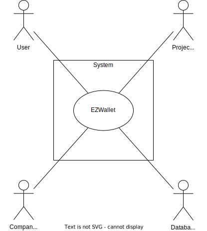
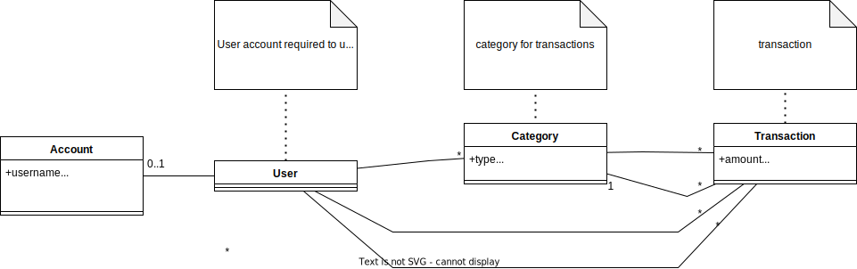
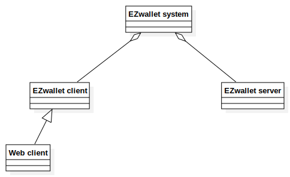
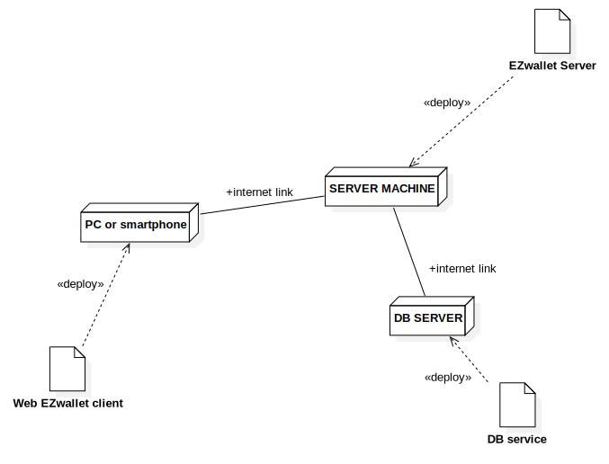

# Requirements Document - current EZWallet

Date: 

Version: V1 - description of EZWallet in CURRENT form (as received by teachers)

 
| Version number | Change |
| ----------------- |:-----------|
| 0.1.11 | added stakeholders| 
| 0.2.2  | added context diagram|
| 0.3.1  | added interfaces| 
| 0.4.5  | added Functional requirements |
| 0.5.1  | added non functional requirements |
| 0.6.1  | added use case diagram |
| 0.7.1  | added Glossary |
| 1.0.0	 | added use cases, system diagram, deployment diagram, stories and personas |
| 1.1.0  | removed admin and users, replaced with a generic user |
| 1.1.1  | removed database and hosting services |
| 1.1.2  | added temporary section : software bugs |

# Contents

- [Informal description](#informal-description)
- [Stakeholders](#stakeholders)
- [Context Diagram and interfaces](#context-diagram-and-interfaces)
	+ [Context Diagram](#context-diagram)
	+ [Interfaces](#interfaces) 
	
- [Stories and personas](#stories-and-personas)
- [Functional and non functional requirements](#functional-and-non-functional-requirements)
	+ [Functional Requirements](#functional-requirements)
	+ [Non functional requirements](#non-functional-requirements)
- [Use case diagram and use cases](#use-case-diagram-and-use-cases)
	+ [Use case diagram](#use-case-diagram)
	+ [Use cases](#use-cases)
    	+ [Relevant scenarios](#relevant-scenarios)
- [Glossary](#glossary)
- [System design](#system-design)
- [Deployment diagram](#deployment-diagram)
- [Software Bugs](#software-bugs)

# Informal description
EZWallet (read EaSy Wallet) is a software application designed to help individuals and families keep track of their expenses. Users can enter and categorize their expenses, allowing them to quickly see where their money is going. EZWallet is a powerful tool for those looking to take control of their finances and make informed decisions about their spending.

# Stakeholders

| Stakeholder name  			| Description | 
| ----------------- 			|:-----------:|
| User						| tracks their expenses |
| Project Team 				| develops, tests and maintains app |
| Company(Owner)			| owns the app, employs and oversees developers, manages finances, takes executive decisions during app development |

# Context Diagram and interfaces

## Context Diagram
<!--Define here Context diagram using UML use case diagram -->

<!--actors are a subset of stakeholders-->

## Interfaces
<!--
\<describe here each interface in the context diagram>

\<GUIs will be described graphically in a separate document>
-->
| Actor 		| Logical Interface 	| Physical Interface  |
| ------------- |:-----------------:	| :------------------:|
| User 		  	|GUI			 		| PC, Smartphone, Tablet |

# Stories and personas
Persona 1: student, male, 20, low income.
* Story: Rented a house, needs to keep track of his expenses so he can pays his rent each month.

Persona 2: employee, female, 42, medium income, married with children, providing for the whole family.
* Story: Since she’s the only one working in the family, she needs to know how family spends money.

Persona 3: unemployed, male, 35, no income with little savings.
* Story: Needs to keep track of his expenses and which are the categories where he spends too much.

# Functional and non functional requirements

## Functional Requirements
<!--
\<In the form DO SOMETHING, or VERB NOUN, describe high level capabilities of the system>

\<they match to high level use cases>
-->

| ID 		| Description  	|
| ----- 	|:-------------:| 
| <b>FR1</b>		| <b>Manage account</b> |
| + FR1.1	| Create account|
| + FR1.2	| Log in  		|
| + FR1.3 	| Log out 		|
| + FR1.4 	| Authenticate and authorize	|
| <b>FR2</b>		| <b>Manage categories</b> | 
| + FR2.1	| Define category	|
| + FR2.2	| View categories	|
| <b>FR3</b>		| <b>Manage transactions</b>	|
| + FR3.1	| add transaction		|
| + FR3.2	| View transactions		|
| + FR3.3	| remove transaction	|
| <b>FR4</b>		| <b>View transactions grouped by category</b>|

## Non Functional Requirements
<!--
\<Describe constraints on functional requirements>
-->
| ID        | Type (efficiency, reliability, ..)           | Description  | Refers to |
| ------------- |:-------------:| :-----:| -----:|
| NFR1 | Usability | no training required, user rating > 4,5/5 | FR:1.1,1.2,1.3,2,3,4 |
| NFR2 | Efficiency | < 0.2ms function response time | All FR |
| NFR3 | Reliability | > 99.99% uptime, < 1hr/year downtime | FR:1.1,1.2,1.3,2,3,4 |
| NFR4 | Portability | Latest stable Firefox, Chrome, Edge browsers with JS and cookies enabled | FR:1.1,1.2,1.3,2,3,4 |
| NFR5 | Security | GDPR, CCPA, ISO/IEC 27000-series compliance | All FR |
| NFR6 | Maintainability | < 24 hr app migration to different service, < 6 hr recovery after failure | All FR |

# Use case diagram and use cases

## Use case diagram
<!--
\<define here UML Use case diagram UCD summarizing all use cases, and their relationships>

\<next describe here each use case in the UCD>
-->

## Use case: Create account
Precondition: User has no account

Scenario 1 (nominal):

*	User ask to sign up
*	System asks username
*	System asks email
*	System asks password
*	System stores account

Post condition: User is registered

Scenario (exceptions):

•	Email already used

Post condition: User is not registered

## Use case: Login
Precondition: User has account

Scenario 1 (nominal):
*	1 User asks to login
*	2 System asks email and password
*	3 User enters email and password
*	4 System checks, email and password correct, user is authorized

Post condition: user is authorized

Scenario (exceptions):
*	User does not exist 
*	User is already logged in
*	Email or password wrong

Post condition  (for all exceptional scenarios): user is not authorized

## Use case: Log out
Precondition: User is logged in

Scenario 1 (nominal):
*	User ask to log out
*	System logs user out

Post condition: User is not authorized anymore
<!--
Scenario (exceptions):
*	User already logged out
*	User not found

Post condition (for all): User is not authorized anymore
-->

## Use case: Create a category
Precondition: User logged in
*	User asks to create a category
*	System asks the type
*	System asks the color
*	System creates the category

Post condition: Category is created

## Use case: View categories
Precondition: User logged in
*	User asks to view all categories
*	System provides all existing categories

## Use case: Create a transaction
Precondition: User logged in
*	User asks to create a transaction
*	System asks the name, amount and type

Post condition: Transaction is created

## Use case: View transactions
Precondition: User logged in
*	User asks to view all transactions
*	System provides all existing transactions

## UC: Delete transaction
Precondition: User logged in
*	User asks to delete a transaction
*	System asks user to indentify the transaction
*	System deletes the transaction

Post condition: Transaction is deleted

## Use case: View transactions grouped by category
Precondition: User logged in
*	User asks to view transactions grouped by category
*	System shows the transactions grouped by category

# Glossary
<!--
\<use UML class diagram to define important terms, or concepts in the domain of the application, and their relationships> 
\<concepts must be used consistently all over the document, ex in use cases, requirements etc>
-->

# System Design

# Deployment Diagram 

# Software Bugs
| ID | Type			| Description  	| Refers to FR 	|
|:--:|:------------:|:-------------:|:-------------:|	
| 1  |Security		| No accessToken validation, anyone can access if non-empty access token in cookie 			| All FR |
| 2  |Functional	| No user specific category/transaction separation. Any user can access/modify other user's data | FR 2, 3 |
