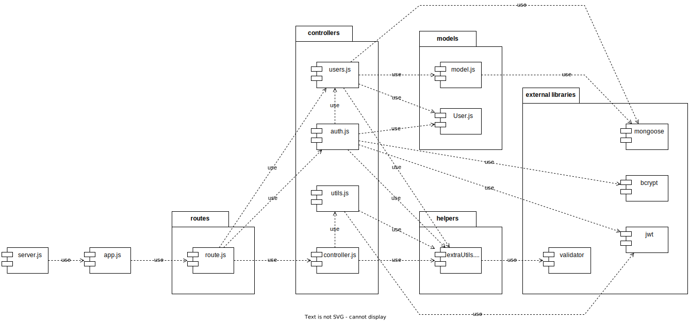

# Test Report

In this document we explain how the application was tested, detailing how the test cases were defined and what they cover

# Contents

- [Test Report](#test-report)
- [Contents](#contents)
- [Dependency graph](#dependency-graph)
- [Integration approach](#integration-approach)
- [Tests](#tests)
- [Coverage](#coverage)
  - [Coverage of FR](#coverage-of-fr)
  - [Coverage white box](#coverage-white-box)

# Dependency graph 

 <!-- <report the here the dependency graph of EzWallet> -->
{: .shadow}

     
# Integration approach

<!--
    <Write here the integration sequence you adopted, in general terms (top down, bottom up, mixed) and as sequence
    (ex: step1: unit A, step 2: unit A+B, step 3: unit A+B+C, etc)> 
    <Some steps may  correspond to unit testing (ex step1 in ex above)>
    <One step will  correspond to API testing, or testing unit route.js>
-->

Followed approach : Bottom Up + Mixed  
Units were developed using mostly a bottom-up approach, with basic implementations first so that API tests could be performed for the implemented functions as early as possible, and a basic working system was already available in the early stages. Any visible problems during API test were also fixed. Then, date and amount filters capability were added later and tested again with API test. After which, exhaustive unit tests and integration tests were created to achieve 100% statement coverage for each type of test while also fixing and perfecting the codes in the process as test failures were encountered. Finally, a simple API test was performed for the whole system.

| Step | Type             | Sequence                                      | functions                                            |
| ---- | ---------------- | --------------------------------------------- | ---------------------------------------------------- |
| 1    | Implementation   | users.js                                      | all                                                  |
| 2    | API test         | users.js                                      | all                                                  |
| 3    | Implementation   | utils.js                                      | verifyAuth                                           |
| 4    | Implementation   | controller.js                                 | all user functions                                   |
| 5    | API test         | utils.js + controller.js                      | all user functions                                   |
| 6    | Implementation   | users.js                                      | all user functions                                   |
| 7    | API test         | utils.js + controller.js + users.js           | all user functions                                   |
| 8    | Implementation   | users.js                                      | all remaining group functions                        |
| 9    | API test         | users.js                                      | all functions                                        |
| 10   | Implementation   | controller.js                                 | all group functions                                  |
| 11   | API test         | controller.js                                 | all functions                                        |
| 12   | Implementation   | utils.js                                      | handleDateParams, handleAmountParams                 |
| 13   | Implementation   | controller.js                                 | getTransactionsByUser(integrate date,amount filters) |
| 14   | API test         | utils.js + controller.js                      | getTransactionsByUser                                |
| 15   | Unit test        | auth.js                                       | all functions                                        |
| 16   | Unit test        | controller.js                                 | all functions                                        |
| 17   | Unit test        | users.js                                      | all functions                                        |
| 18   | Unit test        | utils.js                                      | all functions                                        |
| 19   | Integration test | auth.js                                       | all functions                                        |
| 20   | Integration test | controller.js                                 | all functions                                        |
| 21   | Integration test | users.js                                      | all functions                                        |
| 22   | Integration test | utils.js                                      | all functions                                        |
| 23   | API test         | auth.js + controller.js + users.js + utils.js | all functions                                        |

# Tests

In the table below we list all the test cases, divided as in test files, and stating the name, the object tested, the test level and the technique used to define the test case  

| Test case name                                                                                                                                                                                                                                                                           | Object(s) tested                 | Test level  | Technique used         |
| ---------------------------------------------------------------------------------------------------------------------------------------------------------------------------------------------------------------------------------------------------------------------------------------- | -------------------------------- | ----------- | ---------------------- |
|                                                                                                                                                                                                                                                                                          |                                  |             |                        |
| _in auth.integration.test.js_                                                                                                                                                                                                                                             |                                  |             |                        |
| I1: register                                                                                                                                                                                                                                                                             |                                  |             |                        |
| &nbsp;&nbsp;&nbsp;&nbsp;I1.1√ should register user successfully                                                                                                                                                                                                                  | register                         | integration | WB/ statement coverage |
| &nbsp;&nbsp;&nbsp;&nbsp;I1.2√ should return a 400 error if the email in the request body identifies an already existing user                                                                                                                                                      | register                         | integration | WB/ statement coverage |
| &nbsp;&nbsp;&nbsp;&nbsp;I1.3√ should return a 400 error if the username in the request body identifies an already existing user                                                                                                                                                   | register                         | integration | WB/ statement coverage |
| &nbsp;&nbsp;&nbsp;&nbsp;I1.4√ should return a 400 error if the email in the request body is not in a valid email format                                                                                                                                                           | register                         | integration | WB/ statement coverage |
| &nbsp;&nbsp;&nbsp;&nbsp;I1.5√ should return a 400 error if at least one of the parameters in the request body is an empty string                                                                                                                                                 | register                         | integration | WB/ statement coverage |
| &nbsp;&nbsp;&nbsp;&nbsp;I1.6√ should return a 400 error if the request body does not contain all the necessary attributes                                                                                                                                                        | register                         | integration | WB/ statement coverage |
| I2: registerAdmin                                                                                                                                                                                                                                                                        |                                  |             |                        |
| &nbsp;&nbsp;&nbsp;&nbsp;I2.1√ should register admin successfully                                                                                                                                                                                                                 | registerAdmin                    | integration | WB/ statement coverage |
| &nbsp;&nbsp;&nbsp;&nbsp;I2.2√ should return a 400 error if the email in the request body identifies an already existing user                                                                                                                                                       | registerAdmin                    | integration | WB/ statement coverage |
| &nbsp;&nbsp;&nbsp;&nbsp;I2.3√ should return a 400 error if the username in the request body identifies an already existing user                                                                                                                                                   | registerAdmin                    | integration | WB/ statement coverage |
| &nbsp;&nbsp;&nbsp;&nbsp;I2.4√ should return a 400 error if the email in the request body is not in a valid email format                                                                                                                                                            | registerAdmin                    | integration | WB/ statement coverage |
| &nbsp;&nbsp;&nbsp;&nbsp;I2.5√ should return a 400 error if at least one of the parameters in the request body is an empty string                                                                                                                                                   | registerAdmin                    | integration | WB/ statement coverage |
| &nbsp;&nbsp;&nbsp;&nbsp;I2.6√ should return a 400 error if the request body does not contain all the necessary attributes                                                                                                                                                          | registerAdmin                    | integration | WB/ statement coverage |
| I3: login                                                                                                                                                                                                                                                                                |                                  |             |                        |
| &nbsp;&nbsp;&nbsp;&nbsp;I3.1√ Should login successfully                                                                                                                                                                                                                          | login                            | integration | WB/ statement coverage |
| &nbsp;&nbsp;&nbsp;&nbsp;I3.2√ should return a 400 error if the supplied password does not match with the one in the database                                                                                                                                                     | login                            | integration | WB/ statement coverage |
| &nbsp;&nbsp;&nbsp;&nbsp;I3.3√ should return a 400 error if the email in the request body does not identify a user in the database                                                                                                                                                | login                            | integration | WB/ statement coverage |
| &nbsp;&nbsp;&nbsp;&nbsp;I3.4√ should return a 400 error if the email in the request body is not in a valid email format                                                                                                                                                          | login                            | integration | WB/ statement coverage |
| &nbsp;&nbsp;&nbsp;&nbsp;I3.5√ should return a 400 error if at least one of the parameters in the request body is an empty string                                                                                                                                                 | login                            | integration | WB/ statement coverage |
| &nbsp;&nbsp;&nbsp;&nbsp;I3.6√ should return a 400 error if the request body does not contain all the necessary attributes                                                                                                                                                        | login                            | integration | WB/ statement coverage |
| I4: logout                                                                                                                                                                                                                                                                               |                                  |             |                        |
| &nbsp;&nbsp;&nbsp;&nbsp;I4.1√ Should logout successfully                                                                                                                                                                                                                         | logout                           | integration | WB/ statement coverage |
| &nbsp;&nbsp;&nbsp;&nbsp;I4.2√ should return a 400 error if the refresh token in the request's cookies does not represent a user in the database                                                                                                                                   | logout                           | integration | WB/ statement coverage |
| &nbsp;&nbsp;&nbsp;&nbsp;I4.3√ should return a 400 error if the request does not have a refresh token in the cookies                                                                                                                                                              | logout                           | integration | WB/ statement coverage |
|                                                                                                                                                                                                                                                                                          |                                  |             |                        |
| _in controller.integration.test.js_                                                                                                                                                                                                                                                |                                  |             |                        |
| I5: createCategory                                                                                                                                                                                                                                                                       |                                  |             |                        |
| &nbsp;&nbsp;&nbsp;&nbsp;I5.1√ should create a category                                                                                                                                                                                                                           | createCategory                   | integration | WB/ statement coverage |
| &nbsp;&nbsp;&nbsp;&nbsp;I5.2√ should return a 400 error if the type of category passed in the request body represents an already existing category in the database                                                                                                                | createCategory                   | integration | WB/ statement coverage |
| &nbsp;&nbsp;&nbsp;&nbsp;I5.3√ should return a 400 error if at least one of the parameters in the request body is an empty string                                                                                                                                                   | createCategory                   | integration | WB/ statement coverage |
| &nbsp;&nbsp;&nbsp;&nbsp;I5.4√ should return a 400 error if the request body does not contain all the necessary attributes                                                                                                                                                          | createCategory                   | integration | WB/ statement coverage |
| &nbsp;&nbsp;&nbsp;&nbsp;I5.5√ should return a 401 error if called by an authenticated user who is not an admin (authType = Admin)                                                                                                                                                  | createCategory                   | integration | WB/ statement coverage |
| I6: updateCategory                                                                                                                                                                                                                                                                       |                                  |             |                        |
| &nbsp;&nbsp;&nbsp;&nbsp;I6.1√ should update a category with both new type and new color                                                                                                                                                                                           | updateCategory                   | integration | WB/ statement coverage |
| &nbsp;&nbsp;&nbsp;&nbsp;I6.2√ should update a category with new color                                                                                                                                                                                                             | updateCategory                   | integration | WB/ statement coverage |
| &nbsp;&nbsp;&nbsp;&nbsp;I6.3√ should return a 401 error if called by an authenticated user who is not an admin (authType = Admin)                                                                                                                                                  | updateCategory                   | integration | WB/ statement coverage |
| &nbsp;&nbsp;&nbsp;&nbsp;I6.4√ should return a 400 error if the type of category passed in the request body as the new type represents an already existing category in the database and that category is not the same as the requested one                                         | updateCategory                   | integration | WB/ statement coverage |
| &nbsp;&nbsp;&nbsp;&nbsp;I6.5√ should return a 400 error if the type of category passed as a route parameter does not represent a category in the database                                                                                                                          | updateCategory                   | integration | WB/ statement coverage |
| &nbsp;&nbsp;&nbsp;&nbsp;I6.6√ should return a 400 error if at least one of the parameters in the request body is an empty string                                                                                                                                                   | updateCategory                   | integration | WB/ statement coverage |
| &nbsp;&nbsp;&nbsp;&nbsp;I6.7√ should return a 400 error if the request body does not contain all the necessary attributes                                                                                                                                                          | updateCategory                   | integration | WB/ statement coverage |
| I7: deleteCategory                                                                                                                                                                                                                                                                       |                                  |             |                        |
| &nbsp;&nbsp;&nbsp;&nbsp;I7.1√ should delete all categories except oldest (N==T)                                                                                                                                                                                                   | deleteCategory                   | integration | WB/ statement coverage |
| &nbsp;&nbsp;&nbsp;&nbsp;I7.2√ should delete all categories provided (N>T)                                                                                                                                                                                                         | deleteCategory                   | integration | WB/ statement coverage |
| &nbsp;&nbsp;&nbsp;&nbsp;I7.3√ should return a 401 error if called by an authenticated user who is not an admin (authType = Admin)                                                                                                                                                 | deleteCategory                   | integration | WB/ statement coverage |
| &nbsp;&nbsp;&nbsp;&nbsp;I7.4√ should return a 400 error if at least one of the types in the array does not represent a category in the database                                                                                                                                   | deleteCategory                   | integration | WB/ statement coverage |
| &nbsp;&nbsp;&nbsp;&nbsp;I7.5√ should return a 400 error if the array passed in the request body is empty                                                                                                                                                                          | deleteCategory                   | integration | WB/ statement coverage |
| &nbsp;&nbsp;&nbsp;&nbsp;I7.6√ should return a 400 error if at least one of the types in the array is an empty string                                                                                                                                                               | deleteCategory                   | integration | WB/ statement coverage |
| &nbsp;&nbsp;&nbsp;&nbsp;I7.7√ should return a 400 error if called when there is only one category in the database                                                                                                                                                                  | deleteCategory                   | integration | WB/ statement coverage |
| &nbsp;&nbsp;&nbsp;&nbsp;I7.8√ should return a 400 error if the request body does not contain all the necessary attributes                                                                                                                                                          | deleteCategory                   | integration | WB/ statement coverage |
| I8: getCategories                                                                                                                                                                                                                                                                        |                                  |             |                        |
| &nbsp;&nbsp;&nbsp;&nbsp;I8.1√ should get all categories (user)                                                                                                                                                                                                                     | getCategories                    | integration | WB/ statement coverage |
| &nbsp;&nbsp;&nbsp;&nbsp;I8.2√ should return a 401 error if called by a user who is not authenticated (authType = Simple)                                                                                                                                                            | getCategories                    | integration | WB/ statement coverage |
| I9: createTransaction                                                                                                                                                                                                                                                                    |                                  |             |                        |
| &nbsp;&nbsp;&nbsp;&nbsp;I9.1√ should create a transaction                                                                                                                                                                                                                         | createTransaction                | integration | WB/ statement coverage |
| &nbsp;&nbsp;&nbsp;&nbsp;I9.2√ should return a 401 error if called by an authenticated user who is not the same user as the one in the route parameter (authType = User)                                                                                                           | createTransaction                | integration | WB/ statement coverage |
| &nbsp;&nbsp;&nbsp;&nbsp;I9.3√ should return a 400 error if the amount passed in the request body cannot be parsed as a floatingvalue (negative numbers are accepted)                                                                                                              | createTransaction                | integration | WB/ statement coverage |
| &nbsp;&nbsp;&nbsp;&nbsp;I9.4√ should return a 400 error if the username passed as a route parameter does not represent a user in the database                                                                                                                                     | createTransaction                | integration | WB/ statement coverage |
| &nbsp;&nbsp;&nbsp;&nbsp;I9.5√ should return a 400 error if the username passed in the request body does not represent a user in the database                                                                                                                                       | createTransaction                | integration | WB/ statement coverage |
| &nbsp;&nbsp;&nbsp;&nbsp;I9.6√ should return a 400 error if the username passed in the request body is not equal to the one passed as a route parameter                                                                                                                            | createTransaction                | integration | WB/ statement coverage |
| &nbsp;&nbsp;&nbsp;&nbsp;I9.7√ should return a 400 error if the type of category passed in the request body does not represent a category in the database                                                                                                                           | createTransaction                | integration | WB/ statement coverage |
| &nbsp;&nbsp;&nbsp;&nbsp;I9.8√ should return a 400 error if at least one of the parameters in the request body is an empty string                                                                                                                                                  | createTransaction                | integration | WB/ statement coverage |
| &nbsp;&nbsp;&nbsp;&nbsp;I9.9√ should return a 400 error if the request body does not contain all the necessary attributes                                                                                                                                                         | createTransaction                | integration | WB/ statement coverage |
| I10: getAllTransactions                                                                                                                                                                                                                                                                  |                                  |             |                        |
| &nbsp;&nbsp;&nbsp;&nbsp;I10.1√ should retrieve all user's transactions                                                                                                                                                                                                            | getAllTransactions               | integration | WB/ statement coverage |
| &nbsp;&nbsp;&nbsp;&nbsp;I10.2√ should return a 401 error if called by an authenticated user who is not an admin (authType = Admin)                                                                                                                                                | getAllTransactions               | integration | WB/ statement coverage |
| I11: getTransactionsByUser                                                                                                                                                                                                                                                               |                                  |             |                        |
| &nbsp;&nbsp;&nbsp;&nbsp;I11.1√ should retrieve the user's transactions(admin route)                                                                                                                                                                                               | getTransactionsByUser            | integration | WB/ statement coverage |
| &nbsp;&nbsp;&nbsp;&nbsp;I11.2√ should return a 401 error if called by an authenticated user who is not an admin (authType = Admin) if the route is /api/transactions/users/:username                                                                                              | getTransactionsByUser            | integration | WB/ statement coverage |
| &nbsp;&nbsp;&nbsp;&nbsp;I11.3√ should retrieve the user's transactions(user route) with from and upto                                                                                                                                                                             | getTransactionsByUser            | integration | WB/ statement coverage |
| &nbsp;&nbsp;&nbsp;&nbsp;I11.4√ should return a 401 error if called by an authenticated user who is not the same user as the one in the route (authType = User) if the route is /api/users/:username/transactions                                                                  | getTransactionsByUser            | integration | WB/ statement coverage |
| &nbsp;&nbsp;&nbsp;&nbsp;I11.5√ should return a 400 error if the username passed as a route parameter does not represent a user in the database                                                                                                                                    | getTransactionsByUser            | integration | WB/ statement coverage |
| I12: getTransactionsByUserByCategory                                                                                                                                                                                                                                                     |                                  |             |                        |
| &nbsp;&nbsp;&nbsp;&nbsp;I12.1√ should retrieve the user's transactions belonging to a category(user route)                                                                                                                                                                        | getTransactionsByUserByCategory  | integration | WB/ statement coverage |
| &nbsp;&nbsp;&nbsp;&nbsp;I12.2√ should return a 401 error if called by an authenticated user who is not an admin (authType = Admin) if the route is /api/transactions/users/:username/category/:category                                                                           | getTransactionsByUserByCategory  | integration | WB/ statement coverage |
| &nbsp;&nbsp;&nbsp;&nbsp;I12.3√ should retrieve the user's transactions belonging to a category(admin route)                                                                                                                                                                       | getTransactionsByUserByCategory  | integration | WB/ statement coverage |
| &nbsp;&nbsp;&nbsp;&nbsp;I12.4√ should return a 401 error if called by an authenticated user who is not the same user as the one in the route (authType = User) if the route is /api/users/:username/transactions/category/:category                                               | getTransactionsByUserByCategory  | integration | WB/ statement coverage |
| &nbsp;&nbsp;&nbsp;&nbsp;I12.5√ should return a 400 error if the category passed as a route parameter does not represent a category in the database                                                                                                                                | getTransactionsByUserByCategory  | integration | WB/ statement coverage |
| &nbsp;&nbsp;&nbsp;&nbsp;I12.6√ should return a 400 error if the username passed as a route parameter does not represent a user in the database                                                                                                                                    | getTransactionsByUserByCategory  | integration | WB/ statement coverage |
| I13: getTransactionsByGroup                                                                                                                                                                                                                                                              |                                  |             |                        |
| &nbsp;&nbsp;&nbsp;&nbsp;I13.1√ should retrieve the all group members transactions (user route)                                                                                                                                                                                    | getTransactionsByGroup           | integration | WB/ statement coverage |
| &nbsp;&nbsp;&nbsp;&nbsp;I13.2√ should return a 401 error if called by an authenticated user who is not part of the group (authType = Group) if the route is /api/groups/:name/transactions                                                                                        | getTransactionsByGroup           | integration | WB/ statement coverage |
| &nbsp;&nbsp;&nbsp;&nbsp;I13.3√ should retrieve the all group members transactions (admin route)                                                                                                                                                                                   | getTransactionsByGroup           | integration | WB/ statement coverage |
| &nbsp;&nbsp;&nbsp;&nbsp;I13.4√ should return a 401 error if called by an authenticated user who is not an admin (authType = Admin) if the route is /api/transactions/groups/:name                                                                                                 | getTransactionsByGroup           | integration | WB/ statement coverage |
| &nbsp;&nbsp;&nbsp;&nbsp;I13.5√ should return a 400 error if the group name passed as a route parameter does not represent a group in the database     (admin route, auth first)                                                                                                   | getTransactionsByGroup           | integration | WB/ statement coverage |
| &nbsp;&nbsp;&nbsp;&nbsp;I13.6√ should return a 400 error if the group name passed as a route parameter does not represent a group in the database (user route, group check first)                                                                                                 | getTransactionsByGroup           | integration | WB/ statement coverage |
| I14: getTransactionsByGroupByCategory                                                                                                                                                                                                                                                    |                                  |             |                        |
| &nbsp;&nbsp;&nbsp;&nbsp;I14.1√ should retrieve all group members transactions belonging to a category(user route)                                                                                                                                                                 | getTransactionsByGroupByCategory | integration | WB/ statement coverage |
| &nbsp;&nbsp;&nbsp;&nbsp;I14.2√ should return a 401 error if called by an authenticated user who is not part of the group (authType = Group) if the route is /api/groups/:name/transactions/category/:category                                                                     | getTransactionsByGroupByCategory | integration | WB/ statement coverage |
| &nbsp;&nbsp;&nbsp;&nbsp;I14.3√ should retrieve all group members transactions belonging to a category(admin route)                                                                                                                                                                | getTransactionsByGroupByCategory | integration | WB/ statement coverage |
| &nbsp;&nbsp;&nbsp;&nbsp;I14.4√ should return a 401 error if called by an authenticated user who is not an admin (authType = Admin) if the route is /api/transactions/groups/:name/category/:category                                                                              | getTransactionsByGroupByCategory | integration | WB/ statement coverage |
| &nbsp;&nbsp;&nbsp;&nbsp;I14.5√ should return a 400 error if the group name passed as a route parameter does not represent a group in the database(user route, group check first)                                                                                                  | getTransactionsByGroupByCategory | integration | WB/ statement coverage |
| &nbsp;&nbsp;&nbsp;&nbsp;I14.6√ should return a 400 error if the group name passed as a route parameter does not represent a group in the database(admin route)                                                                                                                    | getTransactionsByGroupByCategory | integration | WB/ statement coverage |
| &nbsp;&nbsp;&nbsp;&nbsp;I14.7√ should return a 400 error if the category passed as a route parameter does not represent a category in the database                                                                                                                                | getTransactionsByGroupByCategory | integration | WB/ statement coverage |
| I15: deleteTransaction                                                                                                                                                                                                                                                                   |                                  |             |                        |
| &nbsp;&nbsp;&nbsp;&nbsp;I15.1√ should delete a transaction                                                                                                                                                                                                                        | deleteTransaction                | integration | WB/ statement coverage |
| &nbsp;&nbsp;&nbsp;&nbsp;I15.2√ should return a 401 error if called by an authenticated user who is not the same user as the one in the route (authType = User)                                                                                                                    | deleteTransaction                | integration | WB/ statement coverage |
| &nbsp;&nbsp;&nbsp;&nbsp;I15.3√ should return a 400 error if the _id in the request body represents a transaction made by a different user than the one in the route                                                                                                               | deleteTransaction                | integration | WB/ statement coverage |
| &nbsp;&nbsp;&nbsp;&nbsp;I15.4√ should return a 400 error if the _id in the request body does not represent a transaction in the database                                                                                                                                          | deleteTransaction                | integration | WB/ statement coverage |
| &nbsp;&nbsp;&nbsp;&nbsp;I15.5√ should return a 400 error if the username passed as a route parameter does not represent a user in the database                                                                                                                                    | deleteTransaction                | integration | WB/ statement coverage |
| &nbsp;&nbsp;&nbsp;&nbsp;I15.6√ should return a 400 error if the _id in the request body is an empty string                                                                                                                                                                        | deleteTransaction                | integration | WB/ statement coverage |
| &nbsp;&nbsp;&nbsp;&nbsp;I15.7√ should return a 400 error if the request body does not contain all the necessary attributes                                                                                                                                                        | deleteTransaction                | integration | WB/ statement coverage |
| &nbsp;&nbsp;&nbsp;&nbsp;I15.8√ should return a 500 error if the id is not valid db id                                                                                                                                                                                             | deleteTransaction                | integration | WB/ statement coverage |
| I16: deleteTransactions                                                                                                                                                                                                                                                                  |                                  |             |                        |
| &nbsp;&nbsp;&nbsp;&nbsp;I16.1√ should delete all transactions                                                                                                                                                                                                                     | deleteTransactions               | integration | WB/ statement coverage |
| &nbsp;&nbsp;&nbsp;&nbsp;I16.2√ should return a 401 error if called by an authenticated user who is not an admin (authType = Admin)                                                                                                                                                | deleteTransactions               | integration | WB/ statement coverage |
| &nbsp;&nbsp;&nbsp;&nbsp;I16.3√ should return a 400 error if at least one of the ids in the array does not represent a transaction in the database                                                                                                                                 | deleteTransactions               | integration | WB/ statement coverage |
| &nbsp;&nbsp;&nbsp;&nbsp;I16.4√ should return a 400 error if at least one of the ids in the array is an empty string                                                                                                                                                               | deleteTransactions               | integration | WB/ statement coverage |
| &nbsp;&nbsp;&nbsp;&nbsp;I16.5√ should return a 400 error if the request body does not contain all the necessary attributes                                                                                                                                                        | deleteTransactions               | integration | WB/ statement coverage |
| &nbsp;&nbsp;&nbsp;&nbsp;I16.6√ should return a 500 error if the transactions id is not valid                                                                                                                                                                                      | deleteTransactions               | integration | WB/ statement coverage |
|                                                                                                                                                                                                                                                                                          |                                  |             |                        |
| _in users.integration.test.js_                                                                                                                                                                                                                                                     |                                  |             |                        |
| I17: getUsers                                                                                                                                                                                                                                                                            |                                  |             |                        |
| &nbsp;&nbsp;&nbsp;&nbsp;I17.1√ should return a 401 error if called by an authenticated user who is not an admin (authType = Admin)                                                                                                                                               | getUsers                         | integration | WB/ statement coverage |
| &nbsp;&nbsp;&nbsp;&nbsp;I17.2√ should retrieve list of all users                                                                                                                                                                                                                  | getUsers                         | integration | WB/ statement coverage |
| I18: getUser                                                                                                                                                                                                                                                                             |                                  | integration |                        |
| &nbsp;&nbsp;&nbsp;&nbsp;I18.1√ should return a 400 error if the username passed as the route parameter does not represent a user in the database                                                                                                                                   | getUser                          | integration | WB/ statement coverage |
| &nbsp;&nbsp;&nbsp;&nbsp;I18.2√ should return a 401 error if called by an authenticated user who is neither the same user as the one in the route parameter (authType = User) nor an admin (authType = Admin)                                                                        | getUser                          | integration | WB/ statement coverage |
| &nbsp;&nbsp;&nbsp;&nbsp;I18.3√ should retrieve a regular user                                                                                                                                                                                                                      | getUser                          | integration | WB/ statement coverage |
| &nbsp;&nbsp;&nbsp;&nbsp;I18.4√ should retrieve a regular user if called by an admin                                                                                                                                                                                               | getUser                          | integration | WB/ statement coverage |
| I19: createGroup                                                                                                                                                                                                                                                                         |                                  |             |                        |
| &nbsp;&nbsp;&nbsp;&nbsp;I19.1√ should return a 400 error if the request body does not contain all the necessary attributes                                                                                                                                                        | createGroup                      | integration | WB/ statement coverage |
| &nbsp;&nbsp;&nbsp;&nbsp;I19.2√ should return a 400 error if the group name passed in the request body is an empty string                                                                                                                                                           | createGroup                      | integration | WB/ statement coverage |
| &nbsp;&nbsp;&nbsp;&nbsp;I19.3√ should create a group                                                                                                                                                                                                                              | createGroup                      | integration | WB/ statement coverage |
| &nbsp;&nbsp;&nbsp;&nbsp;I19.4√ should return a 401 error if called by a user who is not authenticated (authType = Simple)                                                                                                                                                         | createGroup                      | integration | WB/ statement coverage |
| &nbsp;&nbsp;&nbsp;&nbsp;I19.5√ should return a 400 error if at least one of the member emails is an empty string                                                                                                                                                                  | createGroup                      | integration | WB/ statement coverage |
| &nbsp;&nbsp;&nbsp;&nbsp;I19.6√ should return a 400 error if at least one of the member emails is not in a valid email format                                                                                                                                                      | createGroup                      | integration | WB/ statement coverage |
| &nbsp;&nbsp;&nbsp;&nbsp;I19.7√ should return a 400 error if the user who calls the API is already in a group                                                                                                                                                                      | createGroup                      | integration | WB/ statement coverage |
| &nbsp;&nbsp;&nbsp;&nbsp;I19.8√ should return a 400 error if all the provided emails (the ones in the array, the email of the user calling the function does not have to be considered in this case) represent users that are already in a group or do not exist in the  database  | createGroup                      | integration | WB/ statement coverage |
| &nbsp;&nbsp;&nbsp;&nbsp;I19.9√ should return a 400 error if the user who calls the API does not exist                                                                                                                                                                             | createGroup                      | integration | WB/ statement coverage |
| &nbsp;&nbsp;&nbsp;&nbsp;I19.10√ should return a 400 error if the group name passed in the request body represents an already existing group in the database                                                                                                                       | createGroup                      | integration | WB/ statement coverage |
| I20: getGroups                                                                                                                                                                                                                                                                           |                                  |             |                        |
| &nbsp;&nbsp;&nbsp;&nbsp;I20.1√ should get all groups                                                                                                                                                                                                                             | getGroups                        | integration | WB/ statement coverage |
| &nbsp;&nbsp;&nbsp;&nbsp;I20.2√ should return a 401 error if called by an authenticated user who is not an admin (authType = Admin)                                                                                                                                                | getGroups                        | integration | WB/ statement coverage |
| I21: getGroup                                                                                                                                                                                                                                                                            |                                  | integration |                        |
| &nbsp;&nbsp;&nbsp;&nbsp;I21.1√ should get user's group (admin auth)                                                                                                                                                                                                               | getGroup                         | integration | WB/ statement coverage |
| &nbsp;&nbsp;&nbsp;&nbsp;I21.2√ should get user's group (user auth)                                                                                                                                                                                                                | getGroup                         | integration | WB/ statement coverage |
| &nbsp;&nbsp;&nbsp;&nbsp;I21.3√ should return a 401 error if called by an authenticated user who is neither part of the group (authType = Group) nor an admin (authType = Admin)                                                                                                   | getGroup                         | integration | WB/ statement coverage |
| &nbsp;&nbsp;&nbsp;&nbsp;I21.4√ should return a 400 error if the group name passed as a route parameter does not represent a group in the database (admin auth)                                                                                                                    | getGroup                         | integration | WB/ statement coverage |
| &nbsp;&nbsp;&nbsp;&nbsp;I21.5√ should return a 400 error if the group name passed as a route parameter does not represent a group in the database (user auth)                                                                                                                     | getGroup                         | integration | WB/ statement coverage |
| I22: addToGroup                                                                                                                                                                                                                                                                          |                                  |             |                        |
| &nbsp;&nbsp;&nbsp;&nbsp;I22.1√ should add to group (user route)                                                                                                                                                                                                                   | addToGroup                       | integration | WB/ statement coverage |
| &nbsp;&nbsp;&nbsp;&nbsp;I22.2√ should return a 401 error if called by an authenticated user who is not part of the group (authType = Group) if the route is api/groups/:name/add                                                                                                  | addToGroup                       | integration | WB/ statement coverage |
| &nbsp;&nbsp;&nbsp;&nbsp;I22.3√ should add to group (admin route)                                                                                                                                                                                                                  | addToGroup                       | integration | WB/ statement coverage |
| &nbsp;&nbsp;&nbsp;&nbsp;I22.4√ should return a 401 error if called by an authenticated user who is not an admin (authType = Admin) if the route is api/groups/:name/insert                                                                                                        | addToGroup                       | integration | WB/ statement coverage |
| &nbsp;&nbsp;&nbsp;&nbsp;I22.5√ should return a 400 error if at least one of the member emails is not in a valid email format                                                                                                                                                      | addToGroup                       | integration | WB/ statement coverage |
| &nbsp;&nbsp;&nbsp;&nbsp;I22.6√ should return a 400 error if at least one of the member emails is an empty string                                                                                                                                                                  | addToGroup                       | integration | WB/ statement coverage |
| &nbsp;&nbsp;&nbsp;&nbsp;I22.7√ should return a 400 error if all the provided emails represent users that are already in a group or do not exist in the database                                                                                                                   | addToGroup                       | integration | WB/ statement coverage |
| &nbsp;&nbsp;&nbsp;&nbsp;I22.8√ should return a 400 error if the group name passed as a route parameter does not represent a group in the database (user route)                                                                                                                    | addToGroup                       | integration | WB/ statement coverage |
| &nbsp;&nbsp;&nbsp;&nbsp;I22.9√ should return a 400 error if the group name passed as a route parameter does not represent a group in the database  (admin route)                                                                                                                  | addToGroup                       | integration | WB/ statement coverage |
| I23: removeFromGroup                                                                                                                                                                                                                                                                     |                                  |             |                        |
| &nbsp;&nbsp;&nbsp;&nbsp;I23.1√ should remove from group keeping the oldest(user route)                                                                                                                                                                                            | removeFromGroup                  | integration | WB/ statement coverage |
| &nbsp;&nbsp;&nbsp;&nbsp;I23.2√ should return a 401 error if called by an authenticated user who is not part of the group (authType = Group) if the route is api/groups/:name/remove                                                                                               | removeFromGroup                  | integration | WB/ statement coverage |
| &nbsp;&nbsp;&nbsp;&nbsp;I23.3√ should return a 401 error if called by an authenticated user who is not an admin (authType = Admin) if the route is api/groups/:name/pull                                                                                                          | removeFromGroup                  | integration | WB/ statement coverage |
| &nbsp;&nbsp;&nbsp;&nbsp;I23.4√ should remove from group keeping the oldest(admin route)                                                                                                                                                                                          | removeFromGroup                  | integration | WB/ statement coverage |
| &nbsp;&nbsp;&nbsp;&nbsp;I23.5√ should return a 400 error if the group contains only one member before deleting any user  (user auth) (12 ms)                                                                                                                                             | removeFromGroup                  | integration | WB/ statement coverage |
| &nbsp;&nbsp;&nbsp;&nbsp;I23.6√ should return a 400 error if at least one of the emails is an empty string                                                                                                                                                                         | removeFromGroup                  | integration | WB/ statement coverage |
| &nbsp;&nbsp;&nbsp;&nbsp;I23.7√ should return a 400 error if at least one of the emails is not in a valid email format                                                                                                                                                             | removeFromGroup                  | integration | WB/ statement coverage |
| &nbsp;&nbsp;&nbsp;&nbsp;I23.8√ should return a 400 error if all the provided emails represent users that do not belong to the group or do not exist in the database                                                                                                               | removeFromGroup                  | integration | WB/ statement coverage |
| &nbsp;&nbsp;&nbsp;&nbsp;I23.9√ should return a 400 error if the group name passed as a route parameter does not represent a group in the database(user route)                                                                                                                     | removeFromGroup                  | integration | WB/ statement coverage |
| &nbsp;&nbsp;&nbsp;&nbsp;I23.10√ should return a 400 error if the group name passed as a route parameter does not represent a group in the database(admin route)                                                                                                                   | removeFromGroup                  | integration | WB/ statement coverage |
| I24: deleteUser                                                                                                                                                                                                                                                                          |                                  |             |                        |
| &nbsp;&nbsp;&nbsp;&nbsp;I24.1√ should delete user and group                                                                                                                                                                                                                       | deleteUser                       | integration | WB/ statement coverage |
| &nbsp;&nbsp;&nbsp;&nbsp;I24.2√ should delete user and group member                                                                                                                                                                                                                | deleteUser                       | integration | WB/ statement coverage |
| &nbsp;&nbsp;&nbsp;&nbsp;I24.3√ should delete user and not group member                                                                                                                                                                                                            | deleteUser                       | integration | WB/ statement coverage |
| &nbsp;&nbsp;&nbsp;&nbsp;I24.4√ should return a 401 error if called by an authenticated user who is not an admin (authType = Admin)                                                                                                                                                | deleteUser                       | integration | WB/ statement coverage |
| &nbsp;&nbsp;&nbsp;&nbsp;I24.5√ should return a 400 error if the email passed in the request body does not represent a user in the database                                                                                                                                        | deleteUser                       | integration | WB/ statement coverage |
| &nbsp;&nbsp;&nbsp;&nbsp;I24.6√ should return a 400 error if the email passed in the request body is not in correct email format                                                                                                                                                  | deleteUser                       | integration | WB/ statement coverage |
| &nbsp;&nbsp;&nbsp;&nbsp;I24.7√ should return a 400 error if the email passed in the request body is an empty string                                                                                                                                                              | deleteUser                       | integration | WB/ statement coverage |
| &nbsp;&nbsp;&nbsp;&nbsp;I24.8√ should return a 400 error if the request body does not contain all the necessary attributes                                                                                                                                                       | deleteUser                       | integration | WB/ statement coverage |
| &nbsp;&nbsp;&nbsp;&nbsp;I24.9√ should return a 400 error if the email passed in the request body represents an admin                                                                                                                                                             | deleteUser                       | integration | WB/ statement coverage |
| I25: deleteGroup                                                                                                                                                                                                                                                                         |                                  |             |                        |
| &nbsp;&nbsp;&nbsp;&nbsp;I25.1√ should delete group                                                                                                                                                                                                                                | deleteGroup                      | integration | WB/ statement coverage |
| &nbsp;&nbsp;&nbsp;&nbsp;I25.2√ should return a 401 error if called by an authenticated user who is not an admin (authType = Admin)                                                                                                                                                | deleteGroup                      | integration | WB/ statement coverage |
| &nbsp;&nbsp;&nbsp;&nbsp;I25.3√ should return a 400 error if the name passed in the request body does not represent a group in the database                                                                                                                                       | deleteGroup                      | integration | WB/ statement coverage |
| &nbsp;&nbsp;&nbsp;&nbsp;I25.4√ should return a 400 error if the name passed in the request body is an empty string                                                                                                                                                                | deleteGroup                      | integration | WB/ statement coverage |
| &nbsp;&nbsp;&nbsp;&nbsp;I25.5√ should return a 400 error if the request body does not contain all the necessary attributes                                                                                                                                                        | deleteGroup                      | integration | WB/ statement coverage |
|                                                                                                                                                                                                                                                                                          |                                  |             |                        |
| _in utils.integration.test.js_                                                                                                                                                                                                                                                     |                                  |             |                        |
| I26: handleDateFilterParams                                                                                                                                                                                                                                                              |                                  |             |                        |
| &nbsp;&nbsp;&nbsp;&nbsp;I26.1√ should return correct filter using from and upto parameters                                                                                                                                                                                        | handleDateFilterParams           | integration | WB/ statement coverage |
| &nbsp;&nbsp;&nbsp;&nbsp;I26.2√ should return correct filter using from parameters                                                                                                                                                                                                  | handleDateFilterParams           | integration | WB/ statement coverage |
| &nbsp;&nbsp;&nbsp;&nbsp;I26.3√ should return correct filter using upTo parameters                                                                                                                                                                                                  | handleDateFilterParams           | integration | WB/ statement coverage |
| &nbsp;&nbsp;&nbsp;&nbsp;I26.4√ should return correct filter using date parameters                                                                                                                                                                                                 | handleDateFilterParams           | integration | WB/ statement coverage |
| &nbsp;&nbsp;&nbsp;&nbsp;I26.5√ should return nothing since no query defined                                                                                                                                                                                                       | handleDateFilterParams           | integration | WB/ statement coverage |
| &nbsp;&nbsp;&nbsp;&nbsp;I26.6√ should throw error if data is present with the two other parameters (from)                                                                                                                                                                         | handleDateFilterParams           | integration | WB/ statement coverage |
| &nbsp;&nbsp;&nbsp;&nbsp;I26.7√ should throw error if data is present with the two other parameters (upTo)                                                                                                                                                                          | handleDateFilterParams           | integration | WB/ statement coverage |
| &nbsp;&nbsp;&nbsp;&nbsp;I26.8√ should throw error invalid data parameter format                                                                                                                                                                                                    | handleDateFilterParams           | integration | WB/ statement coverage |
| &nbsp;&nbsp;&nbsp;&nbsp;I26.9√ should throw error invalid from parameter format                                                                                                                                                                                                    | handleDateFilterParams           | integration | WB/ statement coverage |
| &nbsp;&nbsp;&nbsp;&nbsp;I26.10√ should throw error invalid upTo parameter format                                                                                                                                                                                                   | handleDateFilterParams           | integration | WB/ statement coverage |
| I27: verifyAuth                                                                                                                                                                                                                                                                          |                                  |             |                        |
| &nbsp;&nbsp;&nbsp;&nbsp;I27.1√ should authorize user and refresh token authType==Simple                                                                                                                                                                                            | verifyAuth                       | integration | WB/ statement coverage |
| &nbsp;&nbsp;&nbsp;&nbsp;I27.2√ should not authorize user and refresh token authType==Simple                                                                                                                                                                                        | verifyAuth                       | integration | WB/ statement coverage |
| &nbsp;&nbsp;&nbsp;&nbsp;I27.3√ should authorize user and refresh token authType==Admin                                                                                                                                                                                             | verifyAuth                       | integration | WB/ statement coverage |
| &nbsp;&nbsp;&nbsp;&nbsp;I27.4√ should not authorize user authType==Admin                                                                                                                                                                                                           | verifyAuth                       | integration | WB/ statement coverage |
| &nbsp;&nbsp;&nbsp;&nbsp;I27.5√ should authorize user and refresh token authType==User                                                                                                                                                                                              | verifyAuth                       | integration | WB/ statement coverage |
| &nbsp;&nbsp;&nbsp;&nbsp;I27.6√ should not authorize user and refresh token authType==User                                                                                                                                                                                          | verifyAuth                       | integration | WB/ statement coverage |
| &nbsp;&nbsp;&nbsp;&nbsp;I27.7√ should authorize user and refresh token where authType==Group                                                                                                                                                                                       | verifyAuth                       | integration | WB/ statement coverage |
| &nbsp;&nbsp;&nbsp;&nbsp;I27.8√ should not authorize user and refresh token where authType==Group                                                                                                                                                                                   | verifyAuth                       | integration | WB/ statement coverage |
| &nbsp;&nbsp;&nbsp;&nbsp;I27.9√ should not authorize user and refresh token where authType==Unknown                                                                                                                                                                                 | verifyAuth                       | integration | WB/ statement coverage |
| &nbsp;&nbsp;&nbsp;&nbsp;I27.10√ should not authorize if access token missing information                                                                                                                                                                                          | verifyAuth                       | integration | WB/ statement coverage |
| &nbsp;&nbsp;&nbsp;&nbsp;I27.11√ should not authorize if refresh token missing information                                                                                                                                                                                          | verifyAuth                       | integration | WB/ statement coverage |
| &nbsp;&nbsp;&nbsp;&nbsp;I27.12√ should not authorize if access token cannot be verified                                                                                                                                                                                            | verifyAuth                       | integration | WB/ statement coverage |
| &nbsp;&nbsp;&nbsp;&nbsp;I27.13√ should not authorize if refresh token cannot be verified                                                                                                                                                                                           | verifyAuth                       | integration | WB/ statement coverage |
| &nbsp;&nbsp;&nbsp;&nbsp;I27.14√ should not authorize if refresh token expired                                                                                                                                                                                                      | verifyAuth                       | integration | WB/ statement coverage |
| &nbsp;&nbsp;&nbsp;&nbsp;I27.15√ should not authorize if missing tokens                                                                                                                                                                                                             | verifyAuth                       | integration | WB/ statement coverage |
| I28: handleAmountFilterParams                                                                                                                                                                                                                                                            |                                  |             |                        |
| &nbsp;&nbsp;&nbsp;&nbsp;I28.1√ should return correct filter using min and max queries                                                                                                                                                                                              | handleAmountFilterParams         | integration | WB/ statement coverage |
| &nbsp;&nbsp;&nbsp;&nbsp;I28.2√ should return correct filter using min queries                                                                                                                                                                                                     | handleAmountFilterParams         | integration | WB/ statement coverage |
| &nbsp;&nbsp;&nbsp;&nbsp;I28.3√ should return correct filter using max queries                                                                                                                                                                                                     | handleAmountFilterParams         | integration | WB/ statement coverage |
| &nbsp;&nbsp;&nbsp;&nbsp;I28.4√ should throw an error for invalid min (since not numerical)                                                                                                                                                                                         | handleAmountFilterParams         | integration | WB/ statement coverage |
| &nbsp;&nbsp;&nbsp;&nbsp;I28.5√ should throw an error for invalid max (since not numerical)                                                                                                                                                                                         | handleAmountFilterParams         | integration | WB/ statement coverage |
| &nbsp;&nbsp;&nbsp;&nbsp;I28.6√ should return nothing since min and max queries not defined                                                                                                                                                                                         | handleAmountFilterParams         | integration | WB/ statement coverage |
|                                                                                                                                                                                                                                                                                          |                                  |             |                        |  |  |  |  |  |
|                                                                                                                                                                                                                                                                                          |                                  |             |                        |  |  |  |  |  |
|                                                                                                                                                                                                                                                                                          |                                  |             |                        |
| _in auth.unit.test.js_                                                                                                                                                                                                                                                             |                                  |             |                        |
| U1: register                                                                                                                                                                                                                                                                             |                                  |             |                        |
| &nbsp;&nbsp;&nbsp;&nbsp;U1.1√ should register user                                                                                                                                                                                                                                 | register                         | unit        | WB/ statement coverage |
| &nbsp;&nbsp;&nbsp;&nbsp;U1.2√ should return a 400 error if the username in the request body identifies an already existing user                                                                                                                                                    | register                         | unit        | WB/ statement coverage |
| &nbsp;&nbsp;&nbsp;&nbsp;U1.3√ should return a 400 error if the email in the request body identifies an already existing user                                                                                                                                                        | register                         | unit        | WB/ statement coverage |
| &nbsp;&nbsp;&nbsp;&nbsp;U1.4√ should return a 400 error if the email in the request body is not in a valid email format                                                                                                                                                            | register                         | unit        | WB/ statement coverage |
| &nbsp;&nbsp;&nbsp;&nbsp;U1.5√ should return a 400 error if at least one of the parameters in the request body is an empty string                                                                                                                                                         | register                         | unit        | WB/ statement coverage |
| &nbsp;&nbsp;&nbsp;&nbsp;U1.6√ should return a 400 error if the request body does not contain all the necessary attributes                                                                                                                                                          | register                         | unit        | WB/ statement coverage |
| &nbsp;&nbsp;&nbsp;&nbsp;U1.7√ should return a 500 error if error is occurs                                                                                                                                                                                                               | register                         | unit        | WB/ statement coverage |
| U2: registerAdmin                                                                                                                                                                                                                                                                        |                                  |             |                        |
| &nbsp;&nbsp;&nbsp;&nbsp;U2.1√ should register admin                                                                                                                                                                                                                                | registerAdmin                    | unit        | WB/ statement coverage |
| &nbsp;&nbsp;&nbsp;&nbsp;U2.2√ should return a 400 error if the username in the request body identifies an already existing user                                                                                                                                                    | registerAdmin                    | unit        | WB/ statement coverage |
| &nbsp;&nbsp;&nbsp;&nbsp;U2.3√ should return a 400 error if the email in the request body identifies an already existing user                                                                                                                                                             | registerAdmin                    | unit        | WB/ statement coverage |
| &nbsp;&nbsp;&nbsp;&nbsp;U2.4√ should return a 400 error if the email in the request body is not in a valid email format                                                                                                                                                                  | registerAdmin                    | unit        | WB/ statement coverage |
| &nbsp;&nbsp;&nbsp;&nbsp;U2.5√ should return a 400 error if at least one of the parameters in the request body is an empty string                                                                                                                                                   | registerAdmin                    | unit        | WB/ statement coverage |
| &nbsp;&nbsp;&nbsp;&nbsp;U2.6√ should return a 400 error if the request body does not contain all the necessary attributes                                                                                                                                                                | registerAdmin                    | unit        | WB/ statement coverage |
| &nbsp;&nbsp;&nbsp;&nbsp;U2.7√ should return a 500 error if error occurs                                                                                                                                                                                                            | registerAdmin                    | unit        | WB/ statement coverage |
| U3: login                      |                                  |         |  |
| &nbsp;&nbsp;&nbsp;&nbsp;U3.1√ should log in successfully |  login                            |     unit        |           WB/ statement coverage             |
| &nbsp;&nbsp;&nbsp;&nbsp;U3.2√ should return a 500 error if any error thrown                                                                                                                                                                                                        | login                            | unit        | WB/ statement coverage |
| &nbsp;&nbsp;&nbsp;&nbsp;U3.3√ should return a 400 error if the supplied password does not match with the one in the database                                                                                                                                                       | login                            | unit        | WB/ statement coverage |
| &nbsp;&nbsp;&nbsp;&nbsp;U3.4√ should return a 400 error if the email in the request body does not identify a user in the database                                                                                                                                                        | login                            | unit        | WB/ statement coverage |
| &nbsp;&nbsp;&nbsp;&nbsp;U3.5√ should return a 400 error if the email in the request body is not in a valid email format                                                                                                                                                                  | login                            | unit        | WB/ statement coverage |
| &nbsp;&nbsp;&nbsp;&nbsp;U3.6√ should return a 400 error if at least one of the parameters in the request body is an empty string                                                                                                                                                         | login                            | unit        | WB/ statement coverage |
| &nbsp;&nbsp;&nbsp;&nbsp;U3.7√ should return a 400 error if the request body does not contain all the necessary attributes                                                                                                                                                                | login                            | unit        | WB/ statement coverage |
| U4: logout                                                                                                                                                                                                                                                                               |                                  |             |                        |
| &nbsp;&nbsp;&nbsp;&nbsp;U4.1√ should log out successfully                                                                                                                                                                                                                          | logout                           | unit        | WB/ statement coverage |
| &nbsp;&nbsp;&nbsp;&nbsp;U4.2√ should return a 500 error if error is thrown                                                                                                                                                                                                         | logout                           | unit        | WB/ statement coverage |
| &nbsp;&nbsp;&nbsp;&nbsp;U4.3√ should return a 400 error if the refresh token in the request's cookies does not represent a user in the database                                                                                                                                           | logout                           | unit        | WB/ statement coverage |
| &nbsp;&nbsp;&nbsp;&nbsp;U4.4√ should return a 400 error if the request does not have a refresh token in the cookies                                                                                                                                                                | logout                           | unit        | WB/ statement coverage |
|                                                                                                                                                                                                                                                                                          |                                  |             |                        |
| _in controller.unit.test.js_                                                                                                                                                                                                                                                       |                                  |             |                        |
| U5: createCategory                                                                                                                                                                                                                                                                       |                                  |             |                        |
| &nbsp;&nbsp;&nbsp;&nbsp;U5.1√ should return 400 error if request body is incomplete                                                                                                                                                                                                | createCategory                   | unit        | WB/ statement coverage |
| &nbsp;&nbsp;&nbsp;&nbsp;U5.2√ should return 400 error if request body contains empty strings                                                                                                                                                                                             | createCategory                   | unit        | WB/ statement coverage |
| &nbsp;&nbsp;&nbsp;&nbsp;U5.3√ should return 401 error if called by an authenticated user who is not an admin                                                                                                                                                                             | createCategory                   | unit        | WB/ statement coverage |
| &nbsp;&nbsp;&nbsp;&nbsp;U5.4√ should return 400 if the type represents an already existing category in the database                                                                                                                                                                | createCategory                   | unit        | WB/ statement coverage |
| &nbsp;&nbsp;&nbsp;&nbsp;U5.5√ should create new category                                                                                                                                                                                                                           | createCategory                   | unit        | WB/ statement coverage |
| &nbsp;&nbsp;&nbsp;&nbsp;U5.6√ should return a 500 if an error occurs                                                                                                                                                                                                               | createCategory                   | unit        | WB/ statement coverage |
| U6: updateCategory                                                                                                                                                                                                                                                                       |                                  |             |                        |
| &nbsp;&nbsp;&nbsp;&nbsp;U6.1√ should return 400 error if request body is incomplete                                                                                                                                                                                                      | updateCategory                   | unit        | WB/ statement coverage |
| &nbsp;&nbsp;&nbsp;&nbsp;U6.2√ should return 400 error if request body contains empty strings                                                                                                                                                                                             | updateCategory                   | unit        | WB/ statement coverage |
| &nbsp;&nbsp;&nbsp;&nbsp;U6.3√ should return 400 error if the type of category passed as a route parameter does not represent a category in the database                                                                                                                                  | updateCategory                   | unit        | WB/ statement coverage |
| &nbsp;&nbsp;&nbsp;&nbsp;U6.4√ should return 400 error if the type of category passed in the request body as the new type represents an already existing category in the database and that category is not the same as the requested one                                            | updateCategory                   | unit        | WB/ statement coverage |
| &nbsp;&nbsp;&nbsp;&nbsp;U6.5√ should return 401 error if called by an authenticated user who is not an admin                                                                                                                                                                             | updateCategory                   | unit        | WB/ statement coverage |
| &nbsp;&nbsp;&nbsp;&nbsp;U6.6√ should update a category's both type and color                                                                                                                                                                                                       | updateCategory                   | unit        | WB/ statement coverage |
| &nbsp;&nbsp;&nbsp;&nbsp;U6.7√ should update a category's color only                                                                                                                                                                                                                      | updateCategory                   | unit        | WB/ statement coverage |
| &nbsp;&nbsp;&nbsp;&nbsp;U6.8√ should return a 500 if an error occurs                                                                                                                                                                                                                     | updateCategory                   | unit        | WB/ statement coverage |
| U7: deleteCategory                                                                                                                                                                                                                                                                       |                                  |             |                        |
| &nbsp;&nbsp;&nbsp;&nbsp;U7.1√ should return 400 error if request body is incomplete                                                                                                                                                                                                | deleteCategory                   | unit        | WB/ statement coverage |
| &nbsp;&nbsp;&nbsp;&nbsp;U7.2√ should return 400 error if called when there is only one category in the database                                                                                                                                                                          | deleteCategory                   | unit        | WB/ statement coverage |
| &nbsp;&nbsp;&nbsp;&nbsp;U7.3√ should return 400 error if at least one of the types in the array is an empty string                                                                                                                                                                       | deleteCategory                   | unit        | WB/ statement coverage |
| &nbsp;&nbsp;&nbsp;&nbsp;U7.4√ should return 400 error if the array passed in the request body is empty                                                                                                                                                                             | deleteCategory                   | unit        | WB/ statement coverage |
| &nbsp;&nbsp;&nbsp;&nbsp;U7.5√ should return 400 error if at least one of the types in the array does not represent a category in the database                                                                                                                                            | deleteCategory                   | unit        | WB/ statement coverage |
| &nbsp;&nbsp;&nbsp;&nbsp;U7.6√ should return 401 error if called by an authenticated user who is not an admin                                                                                                                                                                             | deleteCategory                   | unit        | WB/ statement coverage |
| &nbsp;&nbsp;&nbsp;&nbsp;U7.7√ should delete all categories except oldest and set transactions to oldest                                                                                                                                                                            | deleteCategory                   | unit        | WB/ statement coverage |
| &nbsp;&nbsp;&nbsp;&nbsp;U7.8√ should delete all categories and set transactions to oldest                                                                                                                                                                                          | deleteCategory                   | unit        | WB/ statement coverage |
| &nbsp;&nbsp;&nbsp;&nbsp;U7.9√ should return a 500 if an error occurs                                                                                                                                                                                                                     | deleteCategory                   | unit        | WB/ statement coverage |
| U8: getCategories                                                                                                                                                                                                                                                                        |                                  |             |                        |
| &nbsp;&nbsp;&nbsp;&nbsp;U8.1√ should retrieve all categories                                                                                                                                                                                                                             | getCategories                    | unit        | WB/ statement coverage |
| &nbsp;&nbsp;&nbsp;&nbsp;U8.2√ should return 401 error if called by an authenticated user who is not an admin                                                                                                                                                                       | getCategories                    | unit        | WB/ statement coverage |
| &nbsp;&nbsp;&nbsp;&nbsp;U8.3√ should return a 500 if an error occurs                                                                                                                                                                                                                     | getCategories                    | unit        | WB/ statement coverage |
| U9: createTransaction                                                                                                                                                                                                                                                                    |                                  |             |                        |
| &nbsp;&nbsp;&nbsp;&nbsp;U9.1√ should return 400 error if request body is incomplete                                                                                                                                                                                                | createTransaction                | unit        | WB/ statement coverage |
| &nbsp;&nbsp;&nbsp;&nbsp;U9.2√ should return 400 error if request body contains empty strings                                                                                                                                                                                             | createTransaction                | unit        | WB/ statement coverage |
| &nbsp;&nbsp;&nbsp;&nbsp;U9.3√ should return 400 error if the type of category passed in the request body does not represent a category in the database                                                                                                                             | createTransaction                | unit        | WB/ statement coverage |
| &nbsp;&nbsp;&nbsp;&nbsp;U9.4√ should return 400 error if the username passed in the request body is not equal to the one passed as a route parameter                                                                                                                                      | createTransaction                | unit        | WB/ statement coverage |
| &nbsp;&nbsp;&nbsp;&nbsp;U9.5√ should return 400 error if the username passed in the request body does not represent a user in the database                                                                                                                                               | createTransaction                | unit        | WB/ statement coverage |
| &nbsp;&nbsp;&nbsp;&nbsp;U9.6√ should return 400 error if the username passed as a route parameter does not represent a user in the database                                                                                                                                              | createTransaction                | unit        | WB/ statement coverage |
| &nbsp;&nbsp;&nbsp;&nbsp;U9.7√ should return 400 error if the amount passed in the request body cannot be parsed as a floating value (negative numbers are accepted)                                                                                                               | createTransaction                | unit        | WB/ statement coverage |
| &nbsp;&nbsp;&nbsp;&nbsp;U9.8√ should return 401 error if user is not authenticated                                                                                                                                                                                                       | createTransaction                | unit        | WB/ statement coverage |
| &nbsp;&nbsp;&nbsp;&nbsp;U9.9√ should create transaction                                                                                                                                                                                                                            | createTransaction                | unit        | WB/ statement coverage |
| &nbsp;&nbsp;&nbsp;&nbsp;U9.10√ should return a 500 if an error occurs                                                                                                                                                                                                                    | createTransaction                | unit        | WB/ statement coverage |
| U10: getAllTransactions                                                                                                                                                                                                                                                                  |                                  |             |                        |
| &nbsp;&nbsp;&nbsp;&nbsp;U10.1√ should return 401 error if called by an authenticated user who is not an admin                                                                                                                                                                            | getAllTransactions               | unit        | WB/ statement coverage |
| &nbsp;&nbsp;&nbsp;&nbsp;U10.2√ should retrieve all transactions                                                                                                                                                                                                                    | getAllTransactions               | unit        | WB/ statement coverage |
| &nbsp;&nbsp;&nbsp;&nbsp;U10.3√ should return a 500 if an error occurs                                                                                                                                                                                                              | getAllTransactions               | unit        | WB/ statement coverage |
| U11: getTransactionsByUser                                                                                                                                                                                                                                                               |                                  |             |                        |
| &nbsp;&nbsp;&nbsp;&nbsp;U11.1√ should return 400 error if the user does not exist                                                                                                                                                                                                  | getTransactionsByUser            | unit        | WB/ statement coverage |
| &nbsp;&nbsp;&nbsp;&nbsp;U11.2√ should return 401 error if called by an authenticated user who is not the same user (user route)                                                                                                                                                          | getTransactionsByUser            | unit        | WB/ statement coverage |
| &nbsp;&nbsp;&nbsp;&nbsp;U11.3√ should return 401 error if called by an authenticated user who is not an admin (admin route)                                                                                                                                                        | getTransactionsByUser            | unit        | WB/ statement coverage |
| &nbsp;&nbsp;&nbsp;&nbsp;U11.4√ should throw a "unknown route" error if the path is wrong                                                                                                                                                                                                 | getTransactionsByUser            | unit        | WB/ statement coverage |
| &nbsp;&nbsp;&nbsp;&nbsp;U11.5√ should return all users transactions (user route with date)                                                                                                                                                                                         | getTransactionsByUser            | unit        | WB/ statement coverage |
| &nbsp;&nbsp;&nbsp;&nbsp;U11.6√ should return a 500 if an error occurs                                                                                                                                                                                                              | getTransactionsByUser            | unit        | WB/ statement coverage |
| U12: getTransactionsByUserByCategory                                                                                                                                                                                                                                                     |                                  |         |                        |
| &nbsp;&nbsp;&nbsp;&nbsp;U12.1√ should show all user transactions of  given category (user route)                                                                                                                                                                                   | getTransactionsByUserByCategory  | unit        | WB/ statement coverage |
| &nbsp;&nbsp;&nbsp;&nbsp;U12.2√ should show all user transactions of  given category (admin route)                                                                                                                                                                                  | getTransactionsByUserByCategory  | unit        | WB/ statement coverage |
| &nbsp;&nbsp;&nbsp;&nbsp;U12.3√ should return a 500 error when error is thrown                                                                                                                                                                                                      | getTransactionsByUserByCategory  | unit        | WB/ statement coverage |
| &nbsp;&nbsp;&nbsp;&nbsp;U12.4√ should return 400 error if the username does not represent a user in the database                                                                                                                                                                         | getTransactionsByUserByCategory  | unit        | WB/ statement coverage |
| &nbsp;&nbsp;&nbsp;&nbsp;U12.5√ should return 400 error if the category does not represent a category in the database                                                                                                                                                                     | getTransactionsByUserByCategory  | unit        | WB/ statement coverage |
| &nbsp;&nbsp;&nbsp;&nbsp;U12.6√ should return 401 error if called by an authenticated user who is not the same user (user route)                                                                                                                                                          | getTransactionsByUserByCategory  | unit        | WB/ statement coverage |
| &nbsp;&nbsp;&nbsp;&nbsp;U12.7√ should return 401 error if called by an authenticated user who is not an admin (authType = Admin)                                                                                                                                                         | getTransactionsByUserByCategory  | unit        | WB/ statement coverage |
| &nbsp;&nbsp;&nbsp;&nbsp;U12.8√ should throw a "unknown route" error if the path is wrong                                                                                                                                                                                           | getTransactionsByUserByCategory  | unit        | WB/ statement coverage |
| U13: getTransactionsByGroup                                                                                                                                                                                                                                                              |                                  |             |                        |
| &nbsp;&nbsp;&nbsp;&nbsp;U13.1√ should return 400 error if the group name passed as a route parameter does not represent a group in the database (user route)                                                                                                                       | getTransactionsByGroup           | unit        | WB/ statement coverage |
| &nbsp;&nbsp;&nbsp;&nbsp;U13.2√ should return 400 error if the group name passed as a route parameter does not represent a group in the database (admin route)                                                                                                                            | getTransactionsByGroup           | unit        | WB/ statement coverage |
| &nbsp;&nbsp;&nbsp;&nbsp;U13.3√ should return 401 error if called by an authenticated user who is not part of the group (authType= Group) if the route is /api/groups/:name/transactions                                                                                            | getTransactionsByGroup           | unit        | WB/ statement coverage |
| &nbsp;&nbsp;&nbsp;&nbsp;U13.4√ should return 401 error if called by an authenticated user who is not an admin (authType = Admin)if the route is /api/transactions/groups/:name                                                                                                           | getTransactionsByGroup           | unit        | WB/ statement coverage |
| &nbsp;&nbsp;&nbsp;&nbsp;U13.5√ should throw a "unknown route" error if the path is wrong                                                                                                                                                                                                 | getTransactionsByGroup           | unit        | WB/ statement coverage |
| &nbsp;&nbsp;&nbsp;&nbsp;U13.6√ should show all transactions of members of user's group group (user route)                                                                                                                                                                          | getTransactionsByGroup           | unit        | WB/ statement coverage |
| &nbsp;&nbsp;&nbsp;&nbsp;U13.7√ should show all transactions of members of user's group group (admin route)                                                                                                                                                                         | getTransactionsByGroup           | unit        | WB/ statement coverage |
| U14: getTransactionsByGroupByCategory                                                                                                                                                                                                                                                    |                                  |             |                        |
| &nbsp;&nbsp;&nbsp;&nbsp;U14.1√ should return 400 error if the group name passed as a route parameter does not represent a group in the database(user route)                                                                                                                              | getTransactionsByGroupByCategory | unit        | WB/ statement coverage |
| &nbsp;&nbsp;&nbsp;&nbsp;U14.2√ should return 400 error if the group name passed as a route parameter does not represent a group in the database(admin route)                                                                                                                       | getTransactionsByGroupByCategory | unit        | WB/ statement coverage |
| &nbsp;&nbsp;&nbsp;&nbsp;U14.3√ should return 400 error if the category passed as a route parameter does not represent a categoryin the database                                                                                                                                          | getTransactionsByGroupByCategory | unit        | WB/ statement coverage |
| &nbsp;&nbsp;&nbsp;&nbsp;U14.4√ should return 401 error if called by an authenticated user who is not part of the group (authType= Group) if the route is /api/groups/:name/transactions                                                                                                  | getTransactionsByGroupByCategory | unit        | WB/ statement coverage |
| &nbsp;&nbsp;&nbsp;&nbsp;U14.5√ should return 401 error if called by an authenticated user who is not an admin (authType = Admin)if the route is /api/transactions/groups/:name                                                                                                           | getTransactionsByGroupByCategory | unit        | WB/ statement coverage |
| &nbsp;&nbsp;&nbsp;&nbsp;U14.6√ should throw a "unknown route" error if the path is wrong                                                                                                                                                                                                 | getTransactionsByGroupByCategory | unit        | WB/ statement coverage |
| &nbsp;&nbsp;&nbsp;&nbsp;U14.7√ should show all transactions of member of a group (user route)                                                                                                                                                                                      | getTransactionsByGroupByCategory | unit        | WB/ statement coverage |
| &nbsp;&nbsp;&nbsp;&nbsp;U14.8√ should show all transactions of member of a group (admin route)                                                                                                                                                                                     | getTransactionsByGroupByCategory | unit        | WB/ statement coverage |
| U15: deleteTransaction                                                                                                                                                                                                                                                                   |                                  |             |                        |
| &nbsp;&nbsp;&nbsp;&nbsp;U15.1√ should return 400 error if the request body does not contain all the necessary attributes                                                                                                                                                           | deleteTransaction                | unit        | WB/ statement coverage |
| &nbsp;&nbsp;&nbsp;&nbsp;U15.2√ should return 400 error if the _id in the request body is an empty string                                                                                                                                                                                 | deleteTransaction                | unit        | WB/ statement coverage |
| &nbsp;&nbsp;&nbsp;&nbsp;U15.3√ should return 400 error if the username passed as a route parameter does not represent a user in the database                                                                                                                                       | deleteTransaction                | unit        | WB/ statement coverage |
| &nbsp;&nbsp;&nbsp;&nbsp;U15.4√ should return 400 error if the _id in the request body does not represent a transaction in the database                                                                                                                                                   | deleteTransaction                | unit        | WB/ statement coverage |
| &nbsp;&nbsp;&nbsp;&nbsp;U15.5√ should return 400 error if the _id in the request body represents a transaction made by a different user than the one in the route                                                                                                                 | deleteTransaction                | unit        | WB/ statement coverage |
| &nbsp;&nbsp;&nbsp;&nbsp;U15.6√ should return 401 error if user is not authenticated                                                                                                                                                                                                      | deleteTransaction                | unit        | WB/ statement coverage |
| &nbsp;&nbsp;&nbsp;&nbsp;U15.7√ should delete a transaction                                                                                                                                                                                                                         | deleteTransaction                | unit        | WB/ statement coverage |
| &nbsp;&nbsp;&nbsp;&nbsp;U15.8√ should return a 500 if an error occurs                                                                                                                                                                                                                    | deleteTransaction                | unit        | WB/ statement coverage |
| U16: deleteTransactions                                                                                                                                                                                                                                                                   |                                  |             |                        |
| &nbsp;&nbsp;&nbsp;&nbsp;U16.1√ should return 400 error if the request body does not contain all the necessary attributes                                                                                                                                                           | deleteTransactions               | unit        | WB/ statement coverage |
| &nbsp;&nbsp;&nbsp;&nbsp;U16.2√ should return 400 error if at least one of the ids in the array is an empty string                                                                                                                                                                        | deleteTransactions               | unit        | WB/ statement coverage |
| &nbsp;&nbsp;&nbsp;&nbsp;U16.3√ should return 400 error if at least one of the ids in the array does not represent a transaction in the database                                                                                                                                    | deleteTransactions               | unit        | WB/ statement coverage |
| &nbsp;&nbsp;&nbsp;&nbsp;U16.4√ should return 401 error if called by an authenticated user who is not an admin (authType = Admin)                                                                                                                                                         | deleteTransactions               | unit        | WB/ statement coverage |
| &nbsp;&nbsp;&nbsp;&nbsp;U16.5√ should delete all transactions in an array                                                                                                                                                                                                          | deleteTransactions               | unit        | WB/ statement coverage |
| &nbsp;&nbsp;&nbsp;&nbsp;U16.6√ should return a 500 error if error thrown                                                                                                                                                                                                           | deleteTransactions               | unit        | WB/ statement coverage |
|                                                                                                                                                                                                                                                                                          |                                  |             |                        |
| _in utils.unit.test.js_                                                                                                                                                                                                                                                            |                                  |             |                        |
| U17: handleDateFilterParams                                                                                                                                                                                                                                                              |                                  |             |                        |
| &nbsp;&nbsp;&nbsp;&nbsp;U17.1√ should return an empty object when no date filtering parameters are provided                                                                                                                                                                        | handleDateFilterParams           | unit        | WB/ statement coverage |
| &nbsp;&nbsp;&nbsp;&nbsp;U17.2√ should throw an error if date parameter is provided together with from parameter                                                                                                                                                               | handleDateFilterParams           | unit        | WB/ statement coverage |
| &nbsp;&nbsp;&nbsp;&nbsp;U17.3√ should throw an error if date parameter is provided together with upTo parameter                                                                                                                                                                | handleDateFilterParams           | unit        | WB/ statement coverage |
| &nbsp;&nbsp;&nbsp;&nbsp;U17.4√ should throw an error if date parameter has an invalid format                                                                                                                                                                                     | handleDateFilterParams           | unit        | WB/ statement coverage |
| &nbsp;&nbsp;&nbsp;&nbsp;U17.5√ should handle date parameter correctly                                                                                                                                                                                                                  | handleDateFilterParams           | unit        | WB/ statement coverage |
| &nbsp;&nbsp;&nbsp;&nbsp;U17.6√ should handle from parameter correctly                                                                                                                                                                                                                  | handleDateFilterParams           | unit        | WB/ statement coverage |
| &nbsp;&nbsp;&nbsp;&nbsp;U17.7√ should throw an error if from parameter has an invalid format                                                                                                                                                                                     | handleDateFilterParams           | unit        | WB/ statement coverage |
| &nbsp;&nbsp;&nbsp;&nbsp;U17.8√ should handle upTo parameter correctly                                                                                                                                                                                                                  | handleDateFilterParams           | unit        | WB/ statement coverage |
| &nbsp;&nbsp;&nbsp;&nbsp;U17.9√ should throw an error if upTo parameter has an invalid format                                                                                                                                                                                     | handleDateFilterParams           | unit        | WB/ statement coverage |
| &nbsp;&nbsp;&nbsp;&nbsp;U17.10√ should handle both from and upTo parameters correctly                                                                                                                                                                                                | handleDateFilterParams           | unit        | WB/ statement coverage |
| U18: verifyAuth                                                                                                                                                                                                                                                                          |                                  |             |                        |
| &nbsp;&nbsp;&nbsp;&nbsp;U18.1√ authType Simple, should authorize without refresh token                                                                                                                                                                                             | verifyAuth                       | unit        | WB/ statement coverage |
| &nbsp;&nbsp;&nbsp;&nbsp;U18.2√ authType Simple, should authorize and refresh token                                                                                                                                                                                                 | verifyAuth                       | unit        | WB/ statement coverage |
| &nbsp;&nbsp;&nbsp;&nbsp;U18.3√ authType User, should authorize and refresh token (username match)                                                                                                                                                                                   | verifyAuth                       | unit        | WB/ statement coverage |
| &nbsp;&nbsp;&nbsp;&nbsp;U18.4√ authType User, should not authorize (username mismatch)                                                                                                                                                                                             | verifyAuth                       | unit        | WB/ statement coverage |
| &nbsp;&nbsp;&nbsp;&nbsp;U18.5√ authType Group, should authorize and refresh token (user in group email)                                                                                                                                                                             | verifyAuth                       | unit        | WB/ statement coverage |
| &nbsp;&nbsp;&nbsp;&nbsp;U18.6√ authType Group, should not authorize since user not in the group                                                                                                                                                                                          | verifyAuth                       | unit        | WB/ statement coverage |
| &nbsp;&nbsp;&nbsp;&nbsp;U18.7√ authType Admin, should authorize and refresh token (user role is admin)                                                                                                                                                                              | verifyAuth                       | unit        | WB/ statement coverage |
| &nbsp;&nbsp;&nbsp;&nbsp;U18.8√ authType Admin, should not authorize(user role is not admin)                                                                                                                                                                                               | verifyAuth                       | unit        | WB/ statement coverage |
| &nbsp;&nbsp;&nbsp;&nbsp;U18.9√ authType unknown, should not authorize                                                                                                                                                                                                                    | verifyAuth                       | unit        | WB/ statement coverage |
| &nbsp;&nbsp;&nbsp;&nbsp;U18.10√ authType Simple, should not authorize if error occurs when refreshing                                                                                                                                                                                    | verifyAuth                       | unit        | WB/ statement coverage |
| &nbsp;&nbsp;&nbsp;&nbsp;U18.11√ should not authorize if mismatched tokens                                                                                                                                                                                                          | verifyAuth                       | unit        | WB/ statement coverage |
| &nbsp;&nbsp;&nbsp;&nbsp;U18.12√ should not authorize if access token with missing information                                                                                                                                                                                            | verifyAuth                       | unit        | WB/ statement coverage |
| &nbsp;&nbsp;&nbsp;&nbsp;U18.13√ should not authorize if access token verify fails                                                                                                                                                                                                  | verifyAuth                       | unit        | WB/ statement coverage |
| &nbsp;&nbsp;&nbsp;&nbsp;U18.14√ should not authorize if refresh token with missing information                                                                                                                                                                                           | verifyAuth                       | unit        | WB/ statement coverage |
| &nbsp;&nbsp;&nbsp;&nbsp;U18.15√ should not authorize if refresh token verify fails                                                                                                                                                                                                       | verifyAuth                       | unit        | WB/ statement coverage |
| &nbsp;&nbsp;&nbsp;&nbsp;U18.16√ should not authorize if refresh token expired                                                                                                                                                                                                            | verifyAuth                       | unit        | WB/ statement coverage |
| &nbsp;&nbsp;&nbsp;&nbsp;U18.17√ should not authorize if missing/empty token                                                                                                                                                                                                              | verifyAuth                       | unit        | WB/ statement coverage |
| U19: handleAmountFilterParams                                                                                                                                                                                                                                                            |                                  |             |                        |
| &nbsp;&nbsp;&nbsp;&nbsp;U19.1√ should return an empty object when no query parameters are provided                                                                                                                                                                                       | handleAmountFilterParams         | unit        | WB/ statement coverage |
| &nbsp;&nbsp;&nbsp;&nbsp;U19.2√ should return the correct filter object when only min parameter is provided                                                                                                                                                                                       | handleAmountFilterParams         | unit        | WB/ statement coverage |
| &nbsp;&nbsp;&nbsp;&nbsp;U19.3√ should return the correct filter object when only max parameter is provided                                                                                                                                                                                       | handleAmountFilterParams         | unit        | WB/ statement coverage |
| &nbsp;&nbsp;&nbsp;&nbsp;U19.4√ should return the correct filter object when both min and max parameters are provided                                                                                                                                                                            | handleAmountFilterParams         | unit        | WB/ statement coverage |
| &nbsp;&nbsp;&nbsp;&nbsp;U19.5√ should throw an error when min value is not a number                                                                                                                                                                                                    | handleAmountFilterParams         | unit        | WB/ statement coverage |
| &nbsp;&nbsp;&nbsp;&nbsp;U19.6√ should throw an error when max value is not a number                                                                                                                                                                                                    | handleAmountFilterParams         | unit        | WB/ statement coverage |
| &nbsp;&nbsp;&nbsp;&nbsp;U19.7√ should throw an error when min value is not a number when both min and max parameters are provided                                                                                                                                                             | handleAmountFilterParams         | unit        | WB/ statement coverage |
| &nbsp;&nbsp;&nbsp;&nbsp;U19.8√ should throw an error when max value is not a number when both min and max parameters are provided                                                                                                                                                             | handleAmountFilterParams         | unit        | WB/ statement coverage |
|                                                                                                                                                                                                                                                                                          |                                  |             |                        |
| _in users.unit.test.js_                                                                                                                                                                                                                                                            |                                  |             |                        |
| U20: getUsers                                                                                                                                                                                                                                                                            |                                  |             |                        |
| &nbsp;&nbsp;&nbsp;&nbsp;U20.1√ should retrieve all users                                                                                                                                                                                                                           | getUsers                         | unit        | WB/ statement coverage |
| &nbsp;&nbsp;&nbsp;&nbsp;U20.2√ should return a 500 error when error is thrown                                                                                                                                                                                                      | getUsers                         | unit        | WB/ statement coverage |
| &nbsp;&nbsp;&nbsp;&nbsp;U20.3√ should return a 401 error if called by an authenticated user who is not an admin (authType = Admin)                                                                                                                                                 | getUsers                         | unit        | WB/ statement coverage |
| U21: getUser                                                                                                                                                                                                                                                                             |                                  |             |                        |
| &nbsp;&nbsp;&nbsp;&nbsp;U21.1√ should retrieve user (user auth)                                                                                                                                                                                                                    | getUser                          | unit        | WB/ statement coverage |
| &nbsp;&nbsp;&nbsp;&nbsp;U21.2√ should retrieve user (admin auth)                                                                                                                                                                                                                         | getUser                          | unit        | WB/ statement coverage |
| &nbsp;&nbsp;&nbsp;&nbsp;U21.3√ should return a 500 error when error is thrown                                                                                                                                                                                                            | getUser                          | unit        | WB/ statement coverage |
| &nbsp;&nbsp;&nbsp;&nbsp;U21.4√ should return a 400 error if the username passed as the route parameter does not represent a userin the database                                                                                                                                    | getUser                          | unit        | WB/ statement coverage |
| &nbsp;&nbsp;&nbsp;&nbsp;U21.5√ should return a 401 error if called by an authenticated user who is neither the same user as the one in the route parameter (authType = User) nor an admin (authType = Admin)                                                                      | getUser                          | unit        | WB/ statement coverage |
| U22: createGroup                                                                                                                                                                                                                                                                         |                                  |             |                        |
| &nbsp;&nbsp;&nbsp;&nbsp;U22.1√ should create the group                                                                                                                                                                                                                             | createGroup                      | unit        | WB/ statement coverage |
| &nbsp;&nbsp;&nbsp;&nbsp;U22.2√ should create the group even if calling user email not present and repeating elements                                                                                                                                                               | createGroup                      | unit        | WB/ statement coverage |
| &nbsp;&nbsp;&nbsp;&nbsp;U22.3√ should return a 500 error if error is thrown                                                                                                                                                                                                        | createGroup                      | unit        | WB/ statement coverage |
| &nbsp;&nbsp;&nbsp;&nbsp;U22.4√ should return a 400 error if all the provided emails (the ones in the array, the email of the user calling the function does not have to be considered in this case) represent users that are already in a group or do not exist in the database    | createGroup                      | unit        | WB/ statement coverage |
| &nbsp;&nbsp;&nbsp;&nbsp;U22.5√ should return a 400 error if the user who calls the API is already in a group                                                                                                                                                                       | createGroup                      | unit        | WB/ statement coverage |
| &nbsp;&nbsp;&nbsp;&nbsp;U22.6√ should return a 400 error if the user who calls the API is not found using refresh token                                                                                                                                                            | createGroup                      | unit        | WB/ statement coverage |
| &nbsp;&nbsp;&nbsp;&nbsp;U22.7√ should return a 400 error if the group name passed in the request body represents an already existing group in the database                                                                                                                               | createGroup                      | unit        | WB/ statement coverage |
| &nbsp;&nbsp;&nbsp;&nbsp;U22.8√ should return a 400 error if the group name passed in the request body is an empty string                                                                                                                                                                 | createGroup                      | unit        | WB/ statement coverage |
| &nbsp;&nbsp;&nbsp;&nbsp;U22.9√ should return a 400 error if at least one of the member emails is an empty string                                                                                                                                                                   | createGroup                      | unit        | WB/ statement coverage |
| &nbsp;&nbsp;&nbsp;&nbsp;U22.10√ should return a 400 error if at least one of the member emails is not in a valid email format                                                                                                                                                            | createGroup                      | unit        | WB/ statement coverage |
| &nbsp;&nbsp;&nbsp;&nbsp;U22.11√ should return a 400 error if the request body does not contain all the necessary attributes                                                                                                                                                              | createGroup                      | unit        | WB/ statement coverage |
| &nbsp;&nbsp;&nbsp;&nbsp;U22.12√ should return a 401 error if called by a user who is not authenticated (authType = Simple)                                                                                                                                                         | createGroup                      | unit        | WB/ statement coverage |
| U23: getGroups                                                                                                                                                                                                                                                                           |                                  |             |                        |
| &nbsp;&nbsp;&nbsp;&nbsp;U23.1√ should retrieve all groups                                                                                                                                                                                                                                | getGroups                        | unit        | WB/ statement coverage |
| &nbsp;&nbsp;&nbsp;&nbsp;U23.2√ should return a 500 error when error thrown                                                                                                                                                                                                         | getGroups                        | unit        | WB/ statement coverage |
| &nbsp;&nbsp;&nbsp;&nbsp;U23.3√ should return a 401 error if called by an authenticated user who is not an admin (authType = Admin)                                                                                                                                                       | getGroups                        | unit        | WB/ statement coverage |
| U24: getGroup                                                                                                                                                                                                                                                                            |                                  | unit        | WB/ statement coverage |
| &nbsp;&nbsp;&nbsp;&nbsp;U24.1√ should retrieve the group (user auth)                                                                                                                                                                                                                     | getGroup                         | unit        | WB/ statement coverage |
| &nbsp;&nbsp;&nbsp;&nbsp;U24.2√ should retrieve the group (admin auth)                                                                                                                                                                                                                    | getGroup                         | unit        | WB/ statement coverage |
| &nbsp;&nbsp;&nbsp;&nbsp;U24.3√ should return a 500 error if error thrown (admin)                                                                                                                                                                                                   | getGroup                         | unit        | WB/ statement coverage |
| &nbsp;&nbsp;&nbsp;&nbsp;U24.4√ should return a 401 error if called by an authenticated user who is neither part of the group (authType = Group) nor an admin (authType = Admin)                                                                                                          | getGroup                         | unit        | WB/ statement coverage |
| &nbsp;&nbsp;&nbsp;&nbsp;U24.5√ should return a 400 error if the group name passed as a route parameter does not represent a group in the database (admin)                                                                                                                          | getGroup                         | unit        | WB/ statement coverage |
| &nbsp;&nbsp;&nbsp;&nbsp;U24.6√ should return a 400 error if the group name passed as a route parameter does not represent a group in the database (user)   (1 ms)                                                                                                                        | getGroup                         | unit        | WB/ statement coverage |
| U25: addToGroup                                                                                                                                                                                                                                                                          |                                  |             |                        |
| &nbsp;&nbsp;&nbsp;&nbsp;U25.1√ should add to the group (user route) filtering repeating emails                                                                                                                                                                                     | addToGroup                       | unit        | WB/ statement coverage |
| &nbsp;&nbsp;&nbsp;&nbsp;U25.2√ should add to the group (admin route) filtering repeating emails                                                                                                                                                                                    | addToGroup                       | unit        | WB/ statement coverage |
| &nbsp;&nbsp;&nbsp;&nbsp;U25.3√ should return a 500 error when error is thrown                                                                                                                                                                                                      | addToGroup                       | unit        | WB/ statement coverage |
| &nbsp;&nbsp;&nbsp;&nbsp;U25.4√ should return a 400 error if all the provided emails represent users that do not belong to the group or do not exist in the database                                                                                                                | addToGroup                       | unit        | WB/ statement coverage |
| &nbsp;&nbsp;&nbsp;&nbsp;U25.5√ should return a 400 error if at least one of the member emails is not in a valid email format                                                                                                                                                       | addToGroup                       | unit        | WB/ statement coverage |
| &nbsp;&nbsp;&nbsp;&nbsp;U25.6√ should return a 400 error if at least one of the member emails is an empty string                                                                                                                                                                         | addToGroup                       | unit        | WB/ statement coverage |
| &nbsp;&nbsp;&nbsp;&nbsp;U25.7√ should return a 400 error if the group name passed as a route parameter does not represent a group in the database                                                                                                                                  | addToGroup                       | unit        | WB/ statement coverage |
| &nbsp;&nbsp;&nbsp;&nbsp;U25.8√ should return a 401 error if called by an authenticated user who is not part of the group (authType = Group) if the route is api/groups/:name/add                                                                                                         | addToGroup                       | unit        | WB/ statement coverage |
| &nbsp;&nbsp;&nbsp;&nbsp;U25.9√ should return a 401 error if called by an authenticated user who is not an admin (authType = Admin) if the route is api/groups/:name/insert                                                                                                         | addToGroup                       | unit        | WB/ statement coverage |
| &nbsp;&nbsp;&nbsp;&nbsp;U25.10√ should return a 400 error if group not found in admin route                                                                                                                                                                                              | addToGroup                       | unit        | WB/ statement coverage |
| &nbsp;&nbsp;&nbsp;&nbsp;U25.11√ should return a 500 error when function accessed using unknown route                                                                                                                                                                               | addToGroup                       | unit        | WB/ statement coverage |
| U26: removeFromGroup                                                                                                                                                                                                                                                                     |                                  |             |                        |
| &nbsp;&nbsp;&nbsp;&nbsp;U26.1√ should remove from the group (admin route)                                                                                                                                                                                                          | removeFromGroup                  | unit        | WB/ statement coverage |
| &nbsp;&nbsp;&nbsp;&nbsp;U26.2√ should remove from the group (user route)                                                                                                                                                                                                           | removeFromGroup                  | unit        | WB/ statement coverage |
| &nbsp;&nbsp;&nbsp;&nbsp;U26.3√ should return a 500 error when error is thrown                                                                                                                                                                                                      | removeFromGroup                  | unit        | WB/ statement coverage |
| &nbsp;&nbsp;&nbsp;&nbsp;U26.4√ should return a 400 error if all the provided emails represent users that do not belong to the group or do not exist in the database                                                                                                                | removeFromGroup                  | unit        | WB/ statement coverage |
| &nbsp;&nbsp;&nbsp;&nbsp;U26.5√ should return a 400 error if at least one of the emails is not in a valid email format                                                                                                                                                              | removeFromGroup                  | unit        | WB/ statement coverage |
| &nbsp;&nbsp;&nbsp;&nbsp;U26.6√ should return a 400 error if at least one of the emails is an empty string                                                                                                                                                                          | removeFromGroup                  | unit        | WB/ statement coverage |
| &nbsp;&nbsp;&nbsp;&nbsp;U26.7√ should return a 400 error if the request body does not contain all the necessary attributes                                                                                                                                                               | removeFromGroup                  | unit        | WB/ statement coverage |
| &nbsp;&nbsp;&nbsp;&nbsp;U26.8√ should return a 400 error if the group contains only one member before deleting any user                                                                                                                                                            | removeFromGroup                  | unit        | WB/ statement coverage |
| &nbsp;&nbsp;&nbsp;&nbsp;U26.9√ should return a 401 error if called by an authenticated user who is not part of the group (authType = Group) if the route is api/groups/:name/remove                                                                                                      | removeFromGroup                  | unit        | WB/ statement coverage |
| &nbsp;&nbsp;&nbsp;&nbsp;U26.10√ should return a 400 error if the group name passed as a route parameter does not represent a group in the database (user route)                                                                                                                          | removeFromGroup                  | unit        | WB/ statement coverage |
| &nbsp;&nbsp;&nbsp;&nbsp;U26.11√ should return a 400 error if the group name passed as a route parameter does not represent a group in the database (admin route)                                                                                                                         | removeFromGroup                  | unit        | WB/ statement coverage |
| &nbsp;&nbsp;&nbsp;&nbsp;U26.12√ should return a 401 error if called by an authenticated user who is not an admin (authType = Admin) if the route is api/groups/:name/pull                                                                                                                | removeFromGroup                  | unit        | WB/ statement coverage |
| &nbsp;&nbsp;&nbsp;&nbsp;U26.13√ should return a 500 error when accessed by unknown route                                                                                                                                                                                           | removeFromGroup                  | unit        | WB/ statement coverage |
| U27: deleteUser                                                                                                                                                                                                                                                                          |                                  |             |                        |
| &nbsp;&nbsp;&nbsp;&nbsp;U27.1√ should delete user and member in a group                                                                                                                                                                                                            | deleteUser                       | unit        | WB/ statement coverage |
| &nbsp;&nbsp;&nbsp;&nbsp;U27.2√ should return a 500 when error is thrown                                                                                                                                                                                                            | deleteUser                       | unit        | WB/ statement coverage |
| &nbsp;&nbsp;&nbsp;&nbsp;U27.3√ should delete user and group                                                                                                                                                                                                                        | deleteUser                       | unit        | WB/ statement coverage |
| &nbsp;&nbsp;&nbsp;&nbsp;U27.4√ should delete user but not group member                                                                                                                                                                                                            | deleteUser                       | unit        | WB/ statement coverage |
| &nbsp;&nbsp;&nbsp;&nbsp;U27.5√ should return a 400 error if the email passed in the request body represents an admin                                                                                                                                                                     | deleteUser                       | unit        | WB/ statement coverage |
| &nbsp;&nbsp;&nbsp;&nbsp;U27.6√ should return a 400 error if the email passed in the request body does not represent a user in the database                                                                                                                                        | deleteUser                       | unit        | WB/ statement coverage |
| &nbsp;&nbsp;&nbsp;&nbsp;U27.7√ should return a 400 error if the email passed in the request body is not in correct email format                                                                                                                                                          | deleteUser                       | unit        | WB/ statement coverage |
| &nbsp;&nbsp;&nbsp;&nbsp;U27.8√ should return a 400 error if the email passed in the request body is an empty string                                                                                                                                                                      | deleteUser                       | unit        | WB/ statement coverage |
| &nbsp;&nbsp;&nbsp;&nbsp;U27.9√ should return a 400 error if the request body does not contain all the necessary attributes                                                                                                                                                                | deleteUser                       | unit        | WB/ statement coverage |
| &nbsp;&nbsp;&nbsp;&nbsp;U27.10√ should return a 401 error if called by an authenticated user who is not an admin (authType = Admin)                                                                                                                                                      | deleteUser                       | unit        | WB/ statement coverage |
| U28: deleteGroup                                                                                                                                                                                                                                                                         |                                  |             |                        |
| &nbsp;&nbsp;&nbsp;&nbsp;U28.1√ should delete group successfully                                                                                                                                                                                                                    | deleteGroup                      | unit        | WB/ statement coverage |
| &nbsp;&nbsp;&nbsp;&nbsp;U28.2√ should return a 500 error if error thrown                                                                                                                                                                                                                 | deleteGroup                      | unit        | WB/ statement coverage |
| &nbsp;&nbsp;&nbsp;&nbsp;U28.3√ should return a 400 error if the name passed in the request body does not represent a group in the database                                                                                                                                         | deleteGroup                      | unit        | WB/ statement coverage |
| &nbsp;&nbsp;&nbsp;&nbsp;U28.4√ should return a 400 error if the name passed in the request body is an empty string                                                                                                                                                                       | deleteGroup                      | unit        | WB/ statement coverage |
| &nbsp;&nbsp;&nbsp;&nbsp;U28.5√ should return a 400 error if the request body does not contain all the necessary attributes                                                                                                                                                         | deleteGroup                      | unit        | WB/ statement coverage |
| &nbsp;&nbsp;&nbsp;&nbsp;U28.6√ should return a 401 error if called by an authenticated user who is not an admin (authType = Admin)                                                                                                                                                       | deleteGroup                      | unit        | WB/ statement coverage |

# Coverage

## Coverage of FR

In the following table we are reporting the coverage (which tests and the percentage) of each functional requirements.

| Functional Requirements covered                                | Test(s) | Coverage(%) |
| -------------------------------------------------------------- | ------- | ----------- |
| FR1 : Manage users                                             |         |             |
| &nbsp;&nbsp;&nbsp;&nbsp;FR11: register                         | I1,U1   | (100%)      |
| &nbsp;&nbsp;&nbsp;&nbsp;FR12: login                            | I3,U3   | (100%)      |
| &nbsp;&nbsp;&nbsp;&nbsp;FR13: logout                           | I4,U4   | (100%)      |
| &nbsp;&nbsp;&nbsp;&nbsp;FR14: registerAdmin                    | I2,U2   | (100%)      |
| &nbsp;&nbsp;&nbsp;&nbsp;FR15: getUsers                         | I17,U20 | (100%)      |
| &nbsp;&nbsp;&nbsp;&nbsp;FR16: getUser                          | I18,U21 | (100%)      |
| &nbsp;&nbsp;&nbsp;&nbsp;FR17: deleteUser                       | I24,U27 | (100%)      |
| FR2 : Manage groups                                            |         |             |
| &nbsp;&nbsp;&nbsp;&nbsp;FR21: createGroup                      | I19,U22 | (100%)      |
| &nbsp;&nbsp;&nbsp;&nbsp;FR22: getGroups                        | I20,U23 | (100%)      |
| &nbsp;&nbsp;&nbsp;&nbsp;FR23: getGroup                         | I21,U24 | (100%)      |
| &nbsp;&nbsp;&nbsp;&nbsp;FR24: addToGroup                       | I22,U25 | (100%)      |
| &nbsp;&nbsp;&nbsp;&nbsp;FR26: removeFromGroup                  | I23,U26 | (100%)      |
| &nbsp;&nbsp;&nbsp;&nbsp;FR28: deleteGroup                      | I25,U28 | (100%)      |
| FR3 : Manage  transactions                                     |         |             |
| &nbsp;&nbsp;&nbsp;&nbsp;FR31: createTransaction                | I9,U9   | (100%)      |
| &nbsp;&nbsp;&nbsp;&nbsp;FR32: getAllTransactions               | I10,U10 | (100%)      |
| &nbsp;&nbsp;&nbsp;&nbsp;FR33: getTransactionsByUser            | I11,U11 | (100%)      |
| &nbsp;&nbsp;&nbsp;&nbsp;FR34: getTransactionsByUserByCategory  | I12,U12 | (100%)      |
| &nbsp;&nbsp;&nbsp;&nbsp;FR35: getTransactionsByGroup           | I13,U13 | (100%)      |
| &nbsp;&nbsp;&nbsp;&nbsp;FR36: getTransactionsByGroupByCategory | I14,U14 | (100%)      |
| &nbsp;&nbsp;&nbsp;&nbsp;FR37: deleteTransaction                | I15,U15 | (100%)      |
| &nbsp;&nbsp;&nbsp;&nbsp;FR38: deleteTransactions               | I16,U16 | (100%)      |
| FR4 : Manage categories                                        |         |             |
| &nbsp;&nbsp;&nbsp;&nbsp;FR41: createCategory                   | I5,U5   | (100%)      |
| &nbsp;&nbsp;&nbsp;&nbsp;FR42: updateCategory                   | I6,U6   | (100%)      |
| &nbsp;&nbsp;&nbsp;&nbsp;FR43: deleteCategory                   | I7,U7   | (100%)      |
| &nbsp;&nbsp;&nbsp;&nbsp;FR44: getCategories                    | I8,U8   | (100%)      |
(100%)

## Coverage white box

<!-- Report here the screenshot of coverage values obtained with jest-- coverage  -->
{: .shadow}

